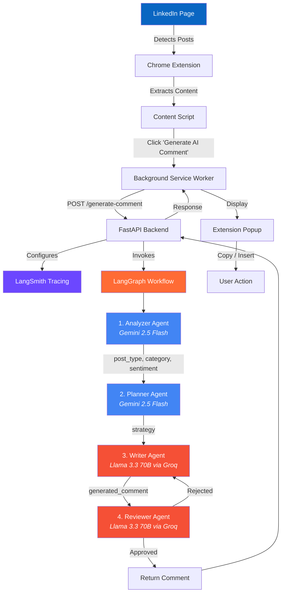
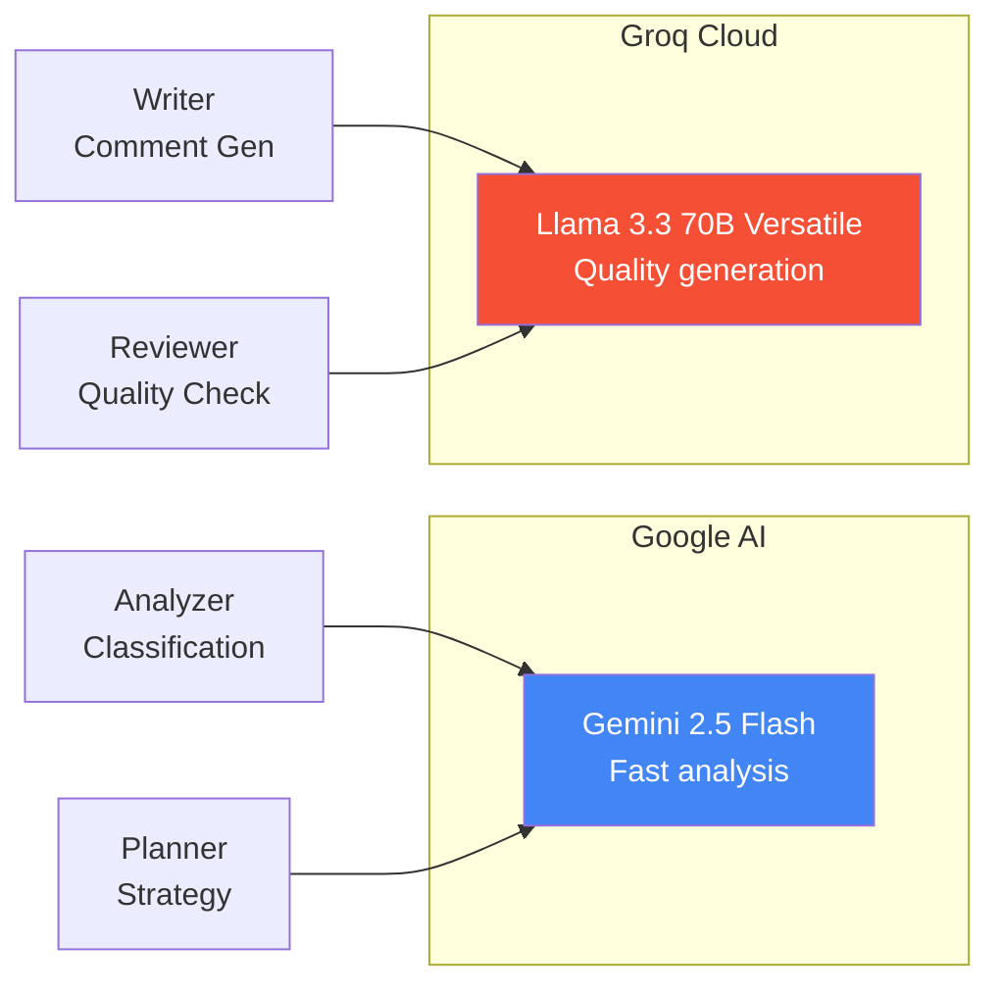
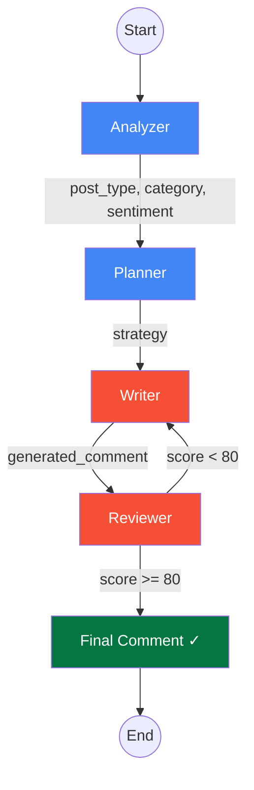
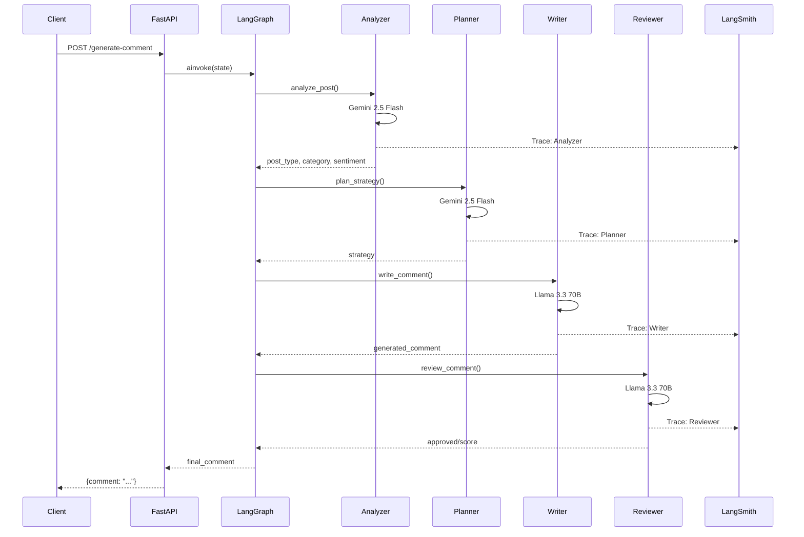

<div align="center">

# LinkedIn AI Comment Copilot

### AI-Powered Chrome Extension for Intelligent LinkedIn Engagement

[](LICENSE)
[](https://python.org)
[](https://langchain-ai.github.io/langgraph/)
[](https://fastapi.tiangolo.com/)
[](https://smith.langchain.com/)
[](https://developer.chrome.com/docs/extensions/mv3/)

*Generate context-aware, human-like LinkedIn comments in real time using a LangGraph multi-agent workflow with Gemini and Llama 3.3.*

[Features](#features) | [Architecture](#architecture) | [Quick Start](#quick-start) | [API Reference](#api-reference) | [Extension Setup](#extension-setup)

</div>

---

## Overview

LinkedIn AI Comment Copilot is a full-stack application consisting of a **Chrome Extension** and a **FastAPI backend** that work together to analyze LinkedIn posts and generate high-quality, context-aware comments. The system uses a **LangGraph multi-agent workflow** with four specialized agents — each powered by the optimal LLM for its task — to ensure every comment is relevant, professional, and human-sounding.

**Key highlights:**
- No database required
- No user authentication
- No data storage — everything runs in real time
- Per-agent model routing (Gemini for analysis, Llama 3.3 for writing/review)
- LangSmith observability for full trace visibility
- Multiple comment tones to match your style

---

## Features

| Feature | Description |
|---------|-------------|
| **Post Detection** | Automatically detects all visible LinkedIn posts on your feed |
| **AI Comment Button** | Injects a "Generate AI Comment" button under every post |
| **Tone Selector** | Choose from 10 comment tones: Professional, Technical, Supportive, Networking, Thoughtful, Friendly, Encouraging, Curious, Founder, Recruiter |
| **Per-Agent Model Routing** | Each agent uses the optimal LLM — Gemini 2.5 Flash for analysis, Llama 3.3 70B for writing & review |
| **LangSmith Observability** | Full trace visibility for every request through the multi-agent pipeline |
| **One-Click Copy** | Copy generated comments to clipboard instantly |
| **Insert to LinkedIn** | Automatically fills the LinkedIn comment box with one click |
| **Regenerate** | Generate alternative variations with a single click |
| **Quality Review** | Built-in reviewer agent scores and approves comments before delivery |

---

## Architecture

### System Flow



### Agent Model Assignment



### LangGraph Agent Pipeline



### Project Structure

```
linkedin-ai-comment-copilot/
├── backend/
│   ├── main.py                    # FastAPI application entry point
│   ├── agents/
│   │   ├── analyzer.py            # Post classification agent
│   │   ├── planner.py             # Comment strategy planner
│   │   ├── writer.py              # Comment generation agent
│   │   └── reviewer.py            # Quality assurance agent
│   ├── graph/
│   │   └── comment_graph.py       # LangGraph workflow definition
│   ├── models/
│   │   ├── llm.py                 # LLM configs (Gemini + Groq)
│   │   └── model_router.py        # Model selection utilities
│   ├── prompts/
│   │   ├── analyzer_prompt.py     # Analyzer system prompt
│   │   ├── planner_prompt.py      # Planner system prompt
│   │   ├── writer_prompt.py       # Writer system prompt
│   │   └── reviewer_prompt.py     # Reviewer system prompt
│   ├── schemas/
│   │   ├── request.py             # Pydantic request models
│   │   └── response.py            # Pydantic response models
│   ├── test_models.py             # Model connectivity test script
│   ├── requirements.txt           # Python dependencies
│   └── .env.example               # Environment variable template
│
├── doc/
│   ├── ARCHITECTURE.md            # System architecture & mermaid diagrams
│   ├── LANGGRAPH_WORKFLOW.md      # Detailed agent pipeline documentation
│   ├── MODEL_AND_LLM_INTEGRATION.md  # LLM configuration & model docs
│   ├── ENVIRONMENT_SETUP.md       # Environment setup guide
│   └── API_REFERENCE.md           # Complete API documentation
│
├── extension/
│   ├── manifest.json              # Chrome Extension Manifest V3
│   ├── content.js                 # LinkedIn page injection script
│   ├── content.css                # Injected button styles
│   ├── popup.html                 # Extension popup UI
│   ├── popup.js                   # Popup logic & API calls
│   ├── popup.css                  # Popup styles
│   ├── background.js              # Service worker for API calls
│   └── icons/                     # Extension icons (16/32/48/128px)
│
└── README.md
```

---

## Tech Stack

### Backend

| Component | Technology | Purpose |
|-----------|-----------|---------|
| **Framework** | FastAPI | Async API server |
| **AI Orchestration** | LangGraph | Multi-agent workflow |
| **LLM Integration** | LangChain + LiteLLM | Prompt management & LLM calls |
| **Analysis & Planning** | Gemini 2.5 Flash (Google) | Fast, accurate post classification & strategy |
| **Writing & Review** | Llama 3.3 70B (Groq) | High-quality comment generation & quality review |
| **Observability** | LangSmith | Tracing, monitoring & debugging |
| **Validation** | Pydantic | Request/response schemas |
| **Server** | Uvicorn | ASGI server |

### Chrome Extension

| Component | Technology | Purpose |
|-----------|-----------|---------|
| **Manifest** | V3 | Chrome Extension standard |
| **Frontend** | Vanilla JS + HTML/CSS | Lightweight, no dependencies |
| **API** | Chrome Extension APIs | Tab management, storage, messaging |
| **Permissions** | `activeTab`, `scripting`, `storage` | Minimal required permissions |

### LLM Models

| Agent | Model | Provider | Temperature | Purpose |
|-------|-------|----------|-------------|---------|
| **Analyzer** | `gemini/gemini-2.5-flash` | Google AI | 0.3 | Post classification, sentiment analysis |
| **Planner** | `gemini/gemini-2.5-flash` | Google AI | 0.5 | Comment strategy determination |
| **Writer** | `groq/llama-3.3-70b-versatile` | Groq Cloud | 0.7 | Comment generation |
| **Reviewer** | `groq/llama-3.3-70b-versatile` | Groq Cloud | 0.3 | Quality scoring & approval |

---

## Quick Start

### Prerequisites

- Python 3.11 or higher
- Google Chrome browser
- [Google AI API key](https://aistudio.google.com/apikey) (free tier available)
- [Groq API key](https://console.groq.com/keys) (free tier available)
- *(Optional)* [LangSmith API key](https://smith.langchain.com/settings) for tracing

### 1. Clone the Repository

```bash
git clone https://github.com/himanshu231204/linkedin-ai-comment-copilot.git
cd linkedin-ai-comment-copilot
```

### 2. Set Up the Backend

```bash
# Navigate to backend
cd backend

# Create virtual environment
python -m venv venv

# Activate virtual environment
# Windows:
venv\Scripts\activate
# macOS/Linux:
source venv/bin/activate

# Install dependencies
pip install -r requirements.txt

# Create environment file
cp .env.example .env

# Add your API keys to .env
```

### 3. Configure Environment Variables

Edit `backend/.env` with your API keys:

```env
# Required — Google AI (Analyzer + Planner agents)
GOOGLE_API_KEY=your_google_api_key_here

# Required — Groq (Writer + Reviewer agents)
GROQ_API_KEY=your_groq_api_key_here

# Optional — LangSmith tracing
LANGCHAIN_API_KEY=your_langsmith_api_key_here
LANGCHAIN_PROJECT=linkedin-ai-comment-copilot
```

### 4. Test Model Connectivity

```bash
python -m backend.test_models
```

You should see all 4 models pass:

```
[+] Analyzer  (Gemini 2.5 Flash): PASS
[+] Planner   (Gemini 2.5 Flash): PASS
[+] Writer    (Llama 3.3 70B - Groq): PASS
[+] Reviewer  (Llama 3.3 70B - Groq): PASS
```

### 5. Start the Backend Server

```bash
# Option 1 — From the backend directory:
cd backend
uvicorn main:app --reload --host 0.0.0.0 --port 8000

# Option 2 — From the project root:
uvicorn backend.main:app --reload --host 0.0.0.0 --port 8000
```

The API will be available at `http://localhost:8000`. Verify it's running:

```bash
curl http://localhost:8000/health
# {"status": "healthy"}
```

### 6. Install the Chrome Extension

1. Open Chrome and navigate to `chrome://extensions/`
2. Enable **Developer mode** (toggle in top-right corner)
3. Click **Load unpacked**
4. Select the `extension/` folder from this project
5. The extension icon will appear in your Chrome toolbar

### 7. Start Using

1. Navigate to [linkedin.com/feed](https://www.linkedin.com/feed/)
2. Open the extension popup by clicking the icon in your toolbar
3. Select your preferred comment tone
4. Click **"Generate AI Comment"** on any post
5. Copy, regenerate, or insert the generated comment

---

## API Reference

### POST `/generate-comment`

Generate a LinkedIn comment using the multi-agent workflow.

**Request Body:**

```json
{
  "post_content": "Just started my new role as Software Engineer at Google! Excited for this new chapter.",
  "tone": "professional"
}
```

**Parameters:**

| Field | Type | Required | Description |
|-------|------|----------|-------------|
| `post_content` | string | Yes | LinkedIn post content (1-5000 chars) |
| `tone` | string | Yes | Comment tone/style |

**Available Tones:**

| Tone | Description |
|------|-------------|
| `professional` | Business-appropriate, formal |
| `technical` | Technical depth and expertise |
| `supportive` | Encouraging and empathetic |
| `networking` | Relationship-building focused |
| `thoughtful` | Deep, reflective insights |
| `friendly` | Warm and approachable |
| `encouraging` | Motivating and uplifting |
| `curious` | Question-driven engagement |
| `founder` | Entrepreneurial perspective |
| `recruiter` | Talent-focused messaging |

**Response:**

```json
{
  "comment": "Congratulations on the new role! Wishing you an exciting and impactful journey at Google."
}
```

---

### GET `/health`

Check API health status.

**Response:**

```json
{
  "status": "healthy"
}
```

---

## How It Works

### 1. Post Analysis (Analyzer Agent — Gemini 2.5 Flash)

The Analyzer agent classifies the LinkedIn post by:
- **Post type**: Internship, Job Update, Promotion, Achievement, Project Showcase, Open Source, Research, Startup, AI/ML, Hackathon, Hiring
- **Category**: Career, Technology, Industry, etc.
- **Sentiment**: Positive, neutral, negative

### 2. Strategy Planning (Planner Agent — Gemini 2.5 Flash)

Based on the post classification and selected tone, the Planner agent determines the optimal comment strategy — what angle to take, what to emphasize, and how to structure the response.

### 3. Comment Writing (Writer Agent — Llama 3.3 70B via Groq)

The Writer agent generates the actual comment following:
- The determined strategy
- The selected tone
- LinkedIn best practices (1-3 lines, max 60 words)
- Human-sounding, non-generic language

### 4. Quality Review (Reviewer Agent — Llama 3.3 70B via Groq)

The Reviewer agent evaluates the generated comment on:
- **Relevance** to the post content
- **Human-likeness** and natural flow
- **Spam score** (low is better)
- **Generic score** (low is better)
- **Professionalism** and appropriateness

If the comment doesn't meet quality standards, the workflow loops back to the Writer for regeneration.

---

## Observability

### LangSmith Integration

All requests are automatically traced through LangSmith when configured. Each agent call, LLM invocation, and graph transition is logged.

**Trace flow per request:**



View traces at: https://smith.langchain.com

---

## Configuration

### Environment Variables

| Variable | Required | Description |
|----------|----------|-------------|
| `GOOGLE_API_KEY` | Yes | Google AI API key (Gemini models) |
| `GROQ_API_KEY` | Yes | Groq API key (Llama 3.3 models) |
| `LANGCHAIN_API_KEY` | No | LangSmith API key for tracing |
| `LANGCHAIN_PROJECT` | No | LangSmith project name (default: `linkedin-ai-comment-copilot`) |
| `HOST` | No | Server host (default: `0.0.0.0`) |
| `PORT` | No | Server port (default: `8000`) |

### CORS Configuration

The backend is pre-configured to accept requests from:
- Chrome Extension (`chrome-extension://*`)
- Local development (`http://localhost:*`)
- LinkedIn domains (`https://*.linkedin.com`)

---

## Development

### Backend Development

```bash
# Option 1 — Run from the backend directory:
cd backend
uvicorn main:app --reload

# Option 2 — Run from the project root:
uvicorn backend.main:app --reload

# API docs available at
# http://localhost:8000/docs (Swagger UI)
# http://localhost:8000/redoc (ReDoc)
```

> **Note:** Both run options work. All Python modules use dual imports (`try/except`) so they work whether imported as a package (`backend.main`) or run directly (`main` from inside `backend/`).

### Extension Development

After making changes to the extension:
1. Go to `chrome://extensions/`
2. Click the refresh icon on your extension
3. Reload the LinkedIn page

---

## Documentation

| Document | Description |
|----------|-------------|
| [Architecture](doc/ARCHITECTURE.md) | System architecture with mermaid diagrams |
| [LangGraph Workflow](doc/LANGGRAPH_WORKFLOW.md) | Detailed agent pipeline & state management |
| [Model & LLM Integration](doc/MODEL_AND_LLM_INTEGRATION.md) | LLM configuration, models & routing |
| [Environment Setup](doc/ENVIRONMENT_SETUP.md) | Environment variables & setup guide |
| [API Reference](doc/API_REFERENCE.md) | Complete API documentation |

---

## Security

- **API Key Safety**: API keys are stored only on the backend server — never exposed to the extension
- **No Data Storage**: No posts, comments, or user data are stored anywhere
- **Minimal Permissions**: The extension only requests `activeTab`, `scripting`, and `storage`
- **CORS Protection**: Backend only accepts requests from allowed origins

---

## Roadmap

### V1.0 (Current)
- Multi-agent comment generation with per-agent model routing
- Gemini 2.5 Flash for analysis & planning
- Llama 3.3 70B via Groq for writing & review
- 10 comment tones
- LangSmith observability
- One-click copy/insert
- Quality review system

### V2.0 (Planned)
- [ ] Comment scoring & analytics
- [ ] Personal writing style learning
- [ ] RAG for domain-specific comments
- [ ] Team workspace
- [ ] LinkedIn engagement analytics
- [ ] Auto-comment suggestions
- [ ] Multi-language support
- [ ] Local Ollama integration
- [ ] Feedback-based learning

---

## Contributing

Contributions are welcome! Please feel free to submit a Pull Request.

1. Fork the repository
2. Create your feature branch (`git checkout -b feature/amazing-feature`)
3. Commit your changes (`git commit -m 'Add amazing feature'`)
4. Push to the branch (`git push origin feature/amazing-feature`)
5. Open a Pull Request

---

## License

This project is licensed under the MIT License — see the [LICENSE](LICENSE) file for details.

---

## Author

**Himanshu** — [LinkedIn](https://linkedin.com/in/himanshu231204) | [GitHub](https://github.com/himanshu231204)

---

<div align="center">

**Built with LangGraph, FastAPI, Gemini, Llama 3.3, and Chrome Extension APIs**

*No database. No auth. Just intelligent comments.*

</div>
