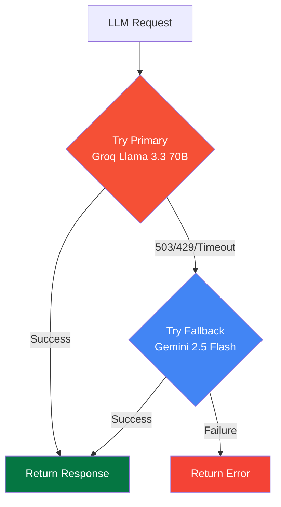
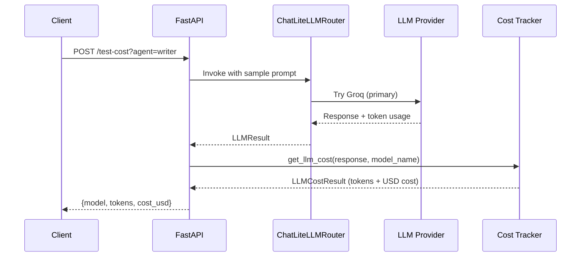
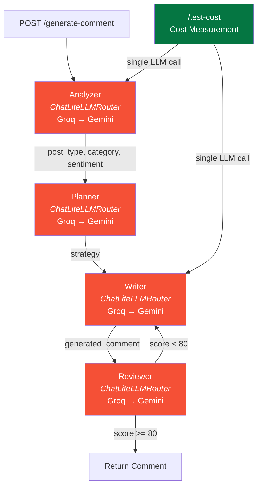

# LinkedIn AI Comment Copilot — Backend

FastAPI backend with LangGraph multi-agent workflow and ChatLiteLLMRouter automatic fallback for generating LinkedIn comments.

---

## Table of Contents

1. [Setup](#setup)
2. [Running the Server](#running-the-server)
3. [API Endpoints](#api-endpoints)
4. [Model Routing](#model-routing)
5. [Cost Testing](#cost-testing)
6. [Architecture](#architecture)
7. [Project Structure](#project-structure)

---

## Setup

### 1. Create a virtual environment

```bash
python -m venv venv
source venv/bin/activate  # On Windows: venv\Scripts\activate
```

### 2. Install dependencies

```bash
pip install -r requirements.txt
```

### 3. Create `.env` file with your API keys

```env
# Required — Groq (Primary LLM for all agents)
GROQ_API_KEY=your_groq_api_key_here

# Optional — Google AI (Fallback LLM — enables automatic failover)
# GOOGLE_API_KEY=your_google_api_key_here

# Optional — LangSmith tracing
# LANGSMITH_API_KEY=your_langsmith_api_key_here
```

Get your keys from:
- **Groq**: [console.groq.com/keys](https://console.groq.com/keys) (free tier: 30 req/min) — **required**
- **Google AI**: [aistudio.google.com/apikey](https://aistudio.google.com/apikey) (free tier: 20 req/day) — optional fallback

---

## Running the Server

```bash
# Development mode with auto-reload
uvicorn main:app --reload --host 0.0.0.0 --port 8000

# Production mode
uvicorn main:app --host 0.0.0.0 --port 8000
```

Verify it's running:

```bash
curl http://localhost:8000/health
# {"status": "healthy"}
```

---

## API Endpoints

### Health Check

```
GET /health
```

**Response:**
```json
{"status": "healthy"}
```

---

### Generate Comment

```
POST /generate-comment
Content-Type: application/json
```

**Request:**
```json
{
  "post_content": "Just started my new role as Software Engineer at Google!",
  "tone": "professional"
}
```

**Response:**
```json
{
  "comment": "Congratulations on the new role! Wishing you an exciting and impactful journey at Google."
}
```

**Supported tones:** `professional`, `technical`, `supportive`, `networking`, `thoughtful`, `friendly`, `encouraging`, `curious`, `founder`, `recruiter`

---

### Test LLM Cost

```
POST /test-cost?agent={agent}
```

**Parameters:**

| Param | Values | Model Tested |
|-------|--------|--------------|
| `agent` | `analyzer`, `planner`, `writer`, `reviewer` | Groq Llama 3.3 70B (with Gemini fallback) |

**Example:**
```bash
curl -X POST http://localhost:8000/test-cost?agent=analyzer
```

**Response:**
```json
{
  "model": "groq/llama-3.3-70b-versatile",
  "prompt_tokens": 150,
  "completion_tokens": 50,
  "total_tokens": 200,
  "input_cost_usd": 0.000089,
  "output_cost_usd": 0.000125,
  "total_cost_usd": 0.000214
}
```

---

## Model Routing

All agents use **ChatLiteLLMRouter** from `langchain_litellm` for automatic model fallback:



### Agent Functions

Each agent has a `create_*_agent_with_router()` function that returns a `ChatLiteLLMRouter`:

```python
from backend.agents.writer import create_writer_agent_with_router

router = create_writer_agent_with_router()
# Uses Groq primary, Gemini fallback
# Handles retries and failover automatically
```

### Router Configuration

| Parameter | Value | Description |
|-----------|-------|-------------|
| `num_retries` | 2 | Retries per model before fallback |
| `retry_after` | 0.5s | Delay between retries |
| `timeout` | 30s | Max wait time per request |
| `local_model_cost_map` | True | Skip network cost lookup (avoids hangs) |

---

## Cost Testing

The backend includes built-in LLM cost tracking. Every call can be measured for token usage and cost.

### How It Works



### Using the Endpoint

```bash
# Test Groq Llama (primary model — all agents)
curl -X POST http://localhost:8000/test-cost?agent=writer
```

### Using in Code

```python
from backend.models.llm import get_llm_cost, create_llm_with_router

router = create_llm_with_router(
    primary_model="groq/llama-3.3-70b-versatile",
    primary_api_key=os.getenv("GROQ_API_KEY"),
    fallback_model="gemini/gemini-2.5-flash",
    fallback_api_key=os.getenv("GOOGLE_API_KEY"),
)
response = await router.ainvoke(messages)

cost = get_llm_cost(response, "groq/llama-3.3-70b-versatile")
print(f"Model: {cost.model}")
print(f"Tokens: {cost.prompt_tokens} in / {cost.completion_tokens} out")
print(f"Cost: ${cost.total_cost_usd}")
```

### Pricing Sources

Cost is calculated using:

1. **Primary**: `litellm.model_cost` — LiteLLM's built-in pricing database (auto-updated)
2. **Fallback**: Hardcoded prices for the models used in this project

| Model | Input (per 1M tokens) | Output (per 1M tokens) |
|-------|----------------------|------------------------|
| `groq/llama-3.3-70b-versatile` | $0.59 | $0.79 |
| `gemini/gemini-2.5-flash` | $0.15 | $0.60 |

---

## Architecture



---

## Project Structure

```
backend/
├── main.py                    # FastAPI entry point + LiteLLM env vars + /test-cost endpoint
├── requirements.txt           # Python dependencies
├── .env.example               # Environment variables template
├── agents/
│   ├── analyzer.py            # Post analysis agent (create_analyzer_agent_with_router)
│   ├── planner.py             # Strategy planning agent (create_planner_agent_with_router)
│   ├── writer.py              # Comment writing agent (create_writer_agent_with_router)
│   └── reviewer.py            # Quality review agent (create_reviewer_agent_with_router)
├── graph/
│   └── comment_graph.py       # LangGraph workflow
├── models/
│   ├── llm.py                 # LLM config, Router factory, cost tracking
│   └── model_router.py        # Model selection utilities
├── prompts/
│   ├── analyzer_prompt.py
│   ├── planner_prompt.py
│   ├── writer_prompt.py
│   └── reviewer_prompt.py
├── schemas/
│   ├── request.py             # Request models
│   └── response.py            # Response models (incl. CostTestResponse)
└── test_models.py             # Model connectivity + Router tests
```

---

## Key Implementation Details

### LiteLLM Telemetry

LiteLLM makes background network calls that can cause hangs. These env vars are set in `main.py` before any LiteLLM imports:

```python
import os
os.environ["LITELLM_LOCAL_MODEL_COST_MAP"] = "True"
os.environ["DO_NOT_TRACK"] = "1"
```

### CORS Configuration

The CORS middleware allows all origins (`["*"]`) to support Chrome extension preflight requests:

```python
app.add_middleware(
    CORSMiddleware,
    allow_origins=["*"],
    allow_credentials=True,
    allow_methods=["*"],
    allow_headers=["*"],
)
```

### Render Deployment

The backend runs on Render with:
- **Procfile**: `web: uvicorn main:app --host 0.0.0.0 --port $PORT`
- **URL**: `https://linkedin-ai-comment-copilot-1.onrender.com`
- **Extension**: Both `background.js` and `popup.js` point to this URL
