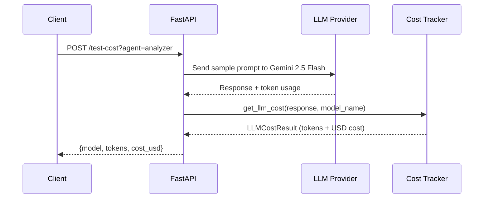
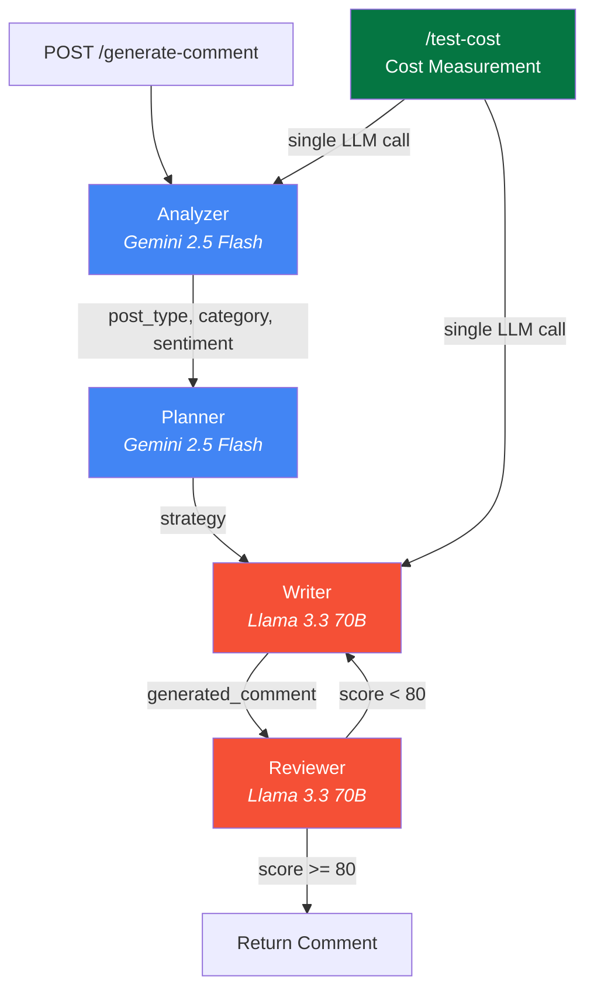

# LinkedIn AI Comment Copilot — Backend

FastAPI backend with LangGraph multi-agent workflow for generating LinkedIn comments.

---

## Table of Contents

1. [Setup](#setup)
2. [Running the Server](#running-the-server)
3. [API Endpoints](#api-endpoints)
4. [Cost Testing](#cost-testing)
5. [Architecture](#architecture)
6. [Project Structure](#project-structure)

---

## Setup

### 1. Create a virtual environment

```bash
python -m venv venv
source venv/bin/activate  # On Windows: venv\Scripts\activate
```

### 2. Install dependencies

```bash
pip install -r requirements.txt
```

### 3. Create `.env` file with your API keys

```env
# Required — Google AI (Analyzer + Planner agents)
GOOGLE_API_KEY=your_google_api_key_here

# Required — Groq (Writer + Reviewer agents)
GROQ_API_KEY=your_groq_api_key_here

# Optional — LangSmith tracing
LANGSMITH_API_KEY=your_langsmith_api_key_here
```

Get your keys from:
- **Google AI**: [aistudio.google.com/apikey](https://aistudio.google.com/apikey) (free tier: 15 req/min)
- **Groq**: [console.groq.com/keys](https://console.groq.com/keys) (free tier: 30 req/min)

---

## Running the Server

```bash
# Development mode with auto-reload
uvicorn main:app --reload --host 0.0.0.0 --port 8000

# Production mode
uvicorn main:app --host 0.0.0.0 --port 8000
```

Verify it's running:

```bash
curl http://localhost:8000/health
# {"status": "healthy"}
```

---

## API Endpoints

### Health Check

```
GET /health
```

**Response:**
```json
{"status": "healthy"}
```

---

### Generate Comment

```
POST /generate-comment
Content-Type: application/json
```

**Request:**
```json
{
  "post_content": "Just started my new role as Software Engineer at Google!",
  "tone": "professional"
}
```

**Response:**
```json
{
  "comment": "Congratulations on the new role! Wishing you an exciting and impactful journey at Google."
}
```

**Supported tones:** `professional`, `technical`, `supportive`, `networking`, `thoughtful`, `friendly`, `encouraging`, `curious`, `founder`, `recruiter`

---

### Test LLM Cost

```
POST /test-cost?agent={agent}
```

**Parameters:**

| Param | Values | Model Tested |
|-------|--------|--------------|
| `agent` | `analyzer`, `planner` | Gemini 2.5 Flash |
| `agent` | `writer`, `reviewer` | Groq Llama 3.3 70B |

**Example:**
```bash
curl -X POST http://localhost:8000/test-cost?agent=analyzer
```

**Response:**
```json
{
  "model": "gemini/gemini-2.5-flash",
  "prompt_tokens": 150,
  "completion_tokens": 50,
  "total_tokens": 200,
  "input_cost_usd": 0.000045,
  "output_cost_usd": 0.000125,
  "total_cost_usd": 0.00017
}
```

See [Cost Testing](#cost-testing) below for full details.

---

## Cost Testing

The backend includes built-in LLM cost tracking. Every call can be measured for token usage and cost.

### How It Works



### Using the Endpoint

```bash
# Test Gemini Flash (analyzer/planner model)
curl -X POST http://localhost:8000/test-cost?agent=analyzer

# Test Groq Llama (writer/reviewer model)
curl -X POST http://localhost:8000/test-cost?agent=writer
```

### Using in Code

```python
from backend.models.llm import get_llm_cost, create_llm, get_analyzer_llm_config

config = get_analyzer_llm_config()
llm = create_llm(config)
response = await llm.ainvoke(messages)

cost = get_llm_cost(response, config.model_name)
print(f"Model: {cost.model}")
print(f"Tokens: {cost.prompt_tokens} in / {cost.completion_tokens} out")
print(f"Cost: ${cost.total_cost_usd}")
```

### Using the Callback Handler

For automatic cost tracking on every LLM call:

```python
from backend.models.llm import LLMCallbackHandler, create_llm, get_analyzer_llm_config

handler = LLMCallbackHandler()
handler.set_model_name("gemini/gemini-2.5-flash")

config = get_analyzer_llm_config()
llm = create_llm(config, callbacks=[handler])
response = await llm.ainvoke(messages)

# Cost is automatically computed
print(handler.last_cost.total_cost_usd)
print(handler.prompt_tokens)
print(handler.completion_tokens)
```

### Pricing Sources

Cost is calculated using:

1. **Primary**: `litellm.model_cost` — LiteLLM's built-in pricing database (auto-updated)
2. **Fallback**: Hardcoded prices for the models used in this project

| Model | Input (per 1M tokens) | Output (per 1M tokens) |
|-------|----------------------|------------------------|
| `gemini/gemini-2.5-flash` | $0.15 | $0.60 |
| `groq/llama-3.3-70b-versatile` | $0.59 | $0.79 |

---

## Architecture



---

## Project Structure

```
backend/
├── main.py                    # FastAPI entry point + /test-cost endpoint
├── requirements.txt           # Python dependencies
├── .env.example               # Environment variables template
├── agents/
│   ├── analyzer.py            # Post analysis agent
│   ├── planner.py             # Strategy planning agent
│   ├── writer.py              # Comment writing agent
│   └── reviewer.py            # Quality review agent
├── graph/
│   └── comment_graph.py       # LangGraph workflow
├── models/
│   ├── llm.py                 # LLM config, cost tracking, factory functions
│   └── model_router.py        # Model selection utilities
├── prompts/
│   ├── analyzer_prompt.py
│   ├── planner_prompt.py
│   ├── writer_prompt.py
│   └── reviewer_prompt.py
├── schemas/
│   ├── request.py             # Request models
│   └── response.py            # Response models (incl. CostTestResponse)
└── test_models.py             # Model connectivity test script
```
