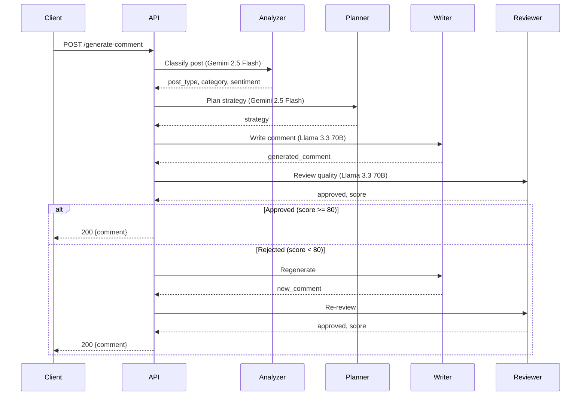

# API Reference

**LinkedIn AI Comment Copilot** — Complete REST API documentation for the FastAPI backend.

---

## Table of Contents

1. [Base URL](#base-url)
2. [POST /generate-comment](#post-generate-comment)
3. [GET /health](#get-health)
4. [Error Handling](#error-handling)
5. [Request/Response Schemas](#requestresponse-schemas)
6. [CORS Configuration](#cors-configuration)

---

## Base URL

```
http://localhost:8000
```

### Interactive Documentation

| Format | URL |
|--------|-----|
| Swagger UI | http://localhost:8000/docs |
| ReDoc | http://localhost:8000/redoc |
| OpenAPI JSON | http://localhost:8000/openapi.json |

---

## POST `/generate-comment`

Generate a LinkedIn comment using the multi-agent LangGraph workflow.

### Request

**Headers:**

| Header | Value | Required |
|--------|-------|----------|
| `Content-Type` | `application/json` | Yes |

**Body:**

```json
{
  "post_content": "Just started my new role as Software Engineer at Google! Excited for this new chapter.",
  "tone": "professional"
}
```

**Parameters:**

| Field | Type | Required | Constraints | Description |
|-------|------|----------|-------------|-------------|
| `post_content` | string | Yes | 1-5000 characters | The LinkedIn post content to comment on |
| `tone` | string | Yes | One of the supported tones | Desired comment tone/style |

### Response

**Success (200):**

```json
{
  "comment": "Congratulations on the new role! Wishing you an exciting and impactful journey at Google."
}
```

**Error (500):**

```json
{
  "detail": "Failed to generate approved comment after review"
}
```

**Error (500 - Server Error):**

```json
{
  "detail": "Internal server error: <error message>"
}
```

---

### Supported Tones

| Tone | Description | Example Style |
|------|-------------|---------------|
| `professional` | Polished, respectful, business-appropriate | "Congratulations on this achievement. Your dedication clearly paid off." |
| `technical` | Knowledgeable, uses relevant terminology | "Impressive architecture! Did you consider using a microservices pattern?" |
| `supportive` | Encouraging, empathetic, validating | "So proud of you! This is well-deserved and I can't wait to see what's next." |
| `networking` | Connection-focused, opens dialogue | "This resonates with my experience. Would love to connect and discuss further." |
| `thoughtful` | Reflective, insightful, deep engagement | "This raises an interesting point about the industry. Here's my take..." |
| `friendly` | Warm, approachable, conversational | "Love this! So happy for you. The hard work is paying off!" |
| `encouraging` | Motivating, uplifting, positive | "Keep pushing forward! Your trajectory is inspiring to watch." |
| `curious` | Inquisitive, asks genuine questions | "Fascinating approach. What led you to this particular solution?" |
| `founder` | Entrepreneurial, strategic, growth-oriented | "Smart move. The market timing looks right for this kind of play." |
| `recruiter` | Talent-focused, opportunity-aware | "Great hire for the team! Strong technical skills combined with culture fit." |

---

### Workflow Detail

Each request triggers the following pipeline:



---

## GET `/health`

Check API health status.

### Request

**Headers:** None required

**Body:** None

### Response

**Success (200):**

```json
{
  "status": "healthy"
}
```

---

## Error Handling

### HTTP Status Codes

| Code | Description | When |
|------|-------------|------|
| `200` | Success | Comment generated successfully |
| `422` | Validation Error | Invalid request body (missing fields, wrong types) |
| `500` | Internal Server Error | LLM failure, review exhaustion, server error |

### Validation Error (422)

When request body doesn't match schema:

```json
{
  "detail": [
    {
      "type": "missing",
      "loc": ["body", "post_content"],
      "msg": "Field required"
    }
  ]
}
```

### Server Error (500)

```json
{
  "detail": "Internal server error: GOOGLE_API_KEY environment variable is required"
}
```

---

## Request/Response Schemas

### GenerateCommentRequest

```python
from pydantic import BaseModel, Field

class GenerateCommentRequest(BaseModel):
    post_content: str = Field(
        ...,
        min_length=1,
        max_length=5000,
        description="LinkedIn post content to generate a comment for"
    )
    tone: str = Field(
        ...,
        description="Comment tone: professional, technical, supportive, networking, thoughtful, friendly, encouraging, curious, founder, recruiter"
    )
```

### GenerateCommentResponse

```python
from pydantic import BaseModel

class GenerateCommentResponse(BaseModel):
    comment: str = Field(
        ...,
        description="The AI-generated LinkedIn comment"
    )
```

### HealthResponse

```python
from pydantic import BaseModel

class HealthResponse(BaseModel):
    status: str = Field(
        default="healthy",
        description="API health status"
    )
```

---

## CORS Configuration

The backend accepts requests from:

| Origin | Pattern | Purpose |
|--------|---------|---------|
| Chrome Extension | `chrome-extension://*` | Extension popup |
| Local Development | `http://localhost:*` | Local testing |
| LinkedIn | `https://*.linkedin.com` | LinkedIn domain |

**Allowed Methods:** `GET`, `POST`, `OPTIONS`
**Allowed Headers:** `*`
**Credentials:** Enabled

---

## Example Usage

### cURL

```bash
curl -X POST http://localhost:8000/generate-comment \
  -H "Content-Type: application/json" \
  -d '{"post_content": "Excited to join Microsoft as a Senior Engineer!", "tone": "supportive"}'
```

### Python

```python
import httpx

response = httpx.post(
    "http://localhost:8000/generate-comment",
    json={
        "post_content": "Excited to join Microsoft as a Senior Engineer!",
        "tone": "supportive",
    }
)

print(response.json()["comment"])
```

### JavaScript (Extension)

```javascript
const response = await fetch("http://localhost:8000/generate-comment", {
  method: "POST",
  headers: { "Content-Type": "application/json" },
  body: JSON.stringify({
    post_content: postText,
    tone: selectedTone,
  }),
});

const data = await response.json();
console.log(data.comment);
```

---

*Last updated: June 2026*
