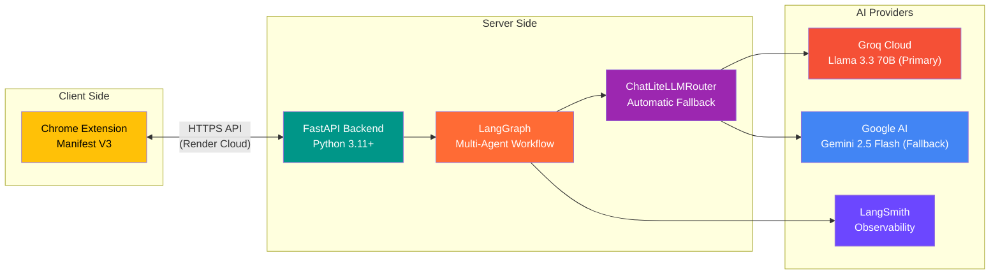
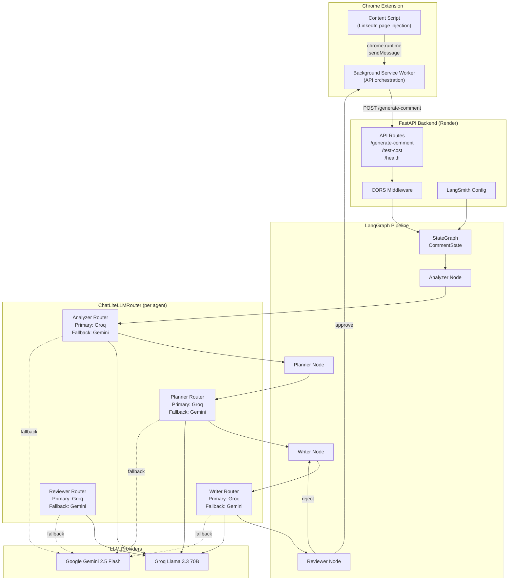
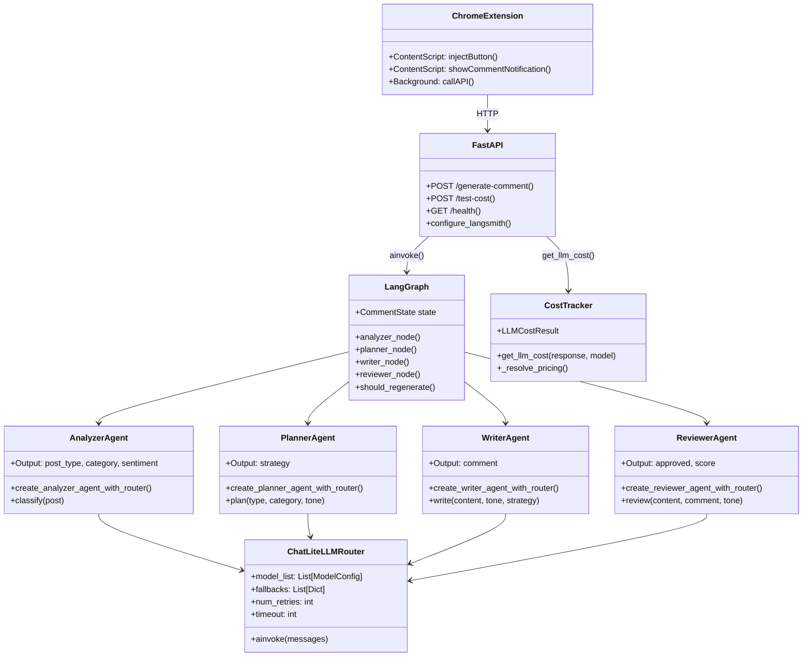
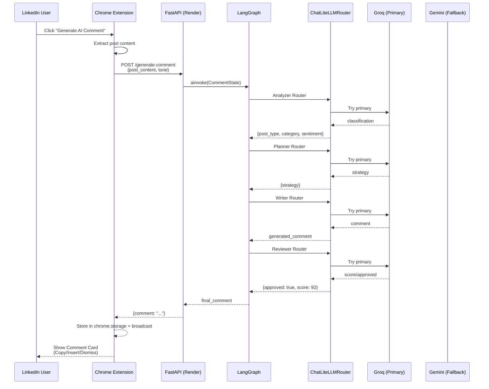
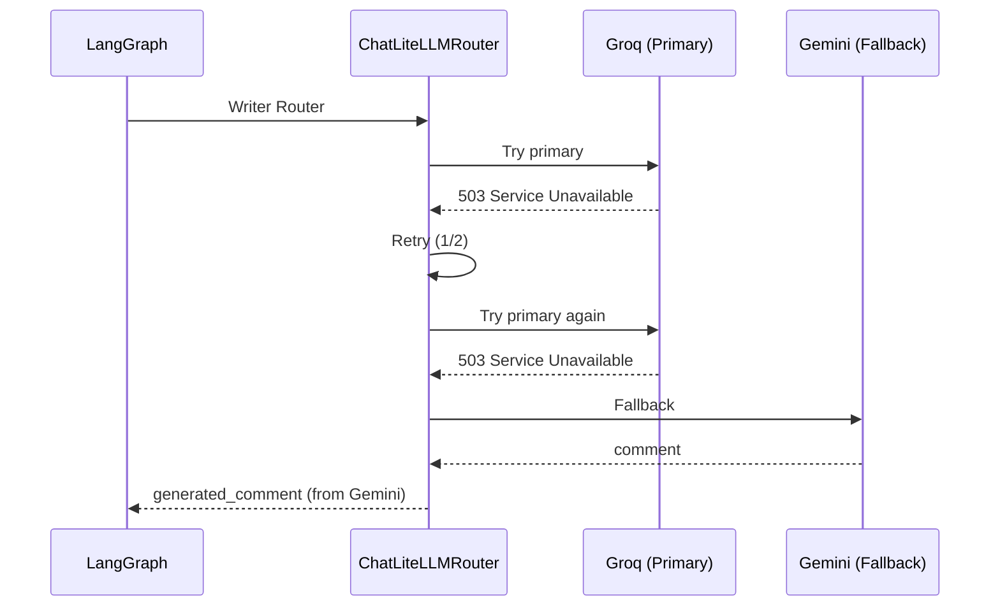
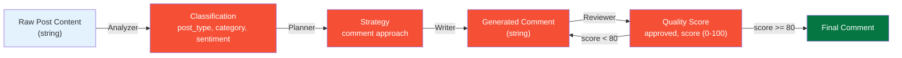
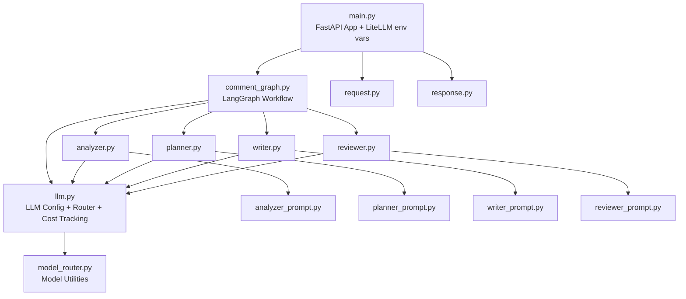
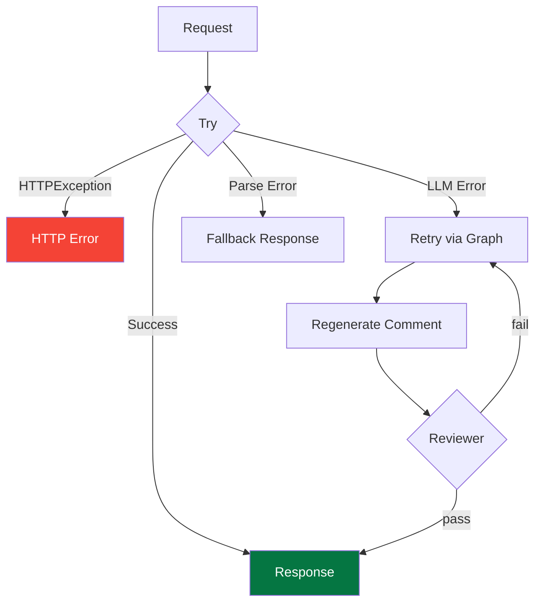
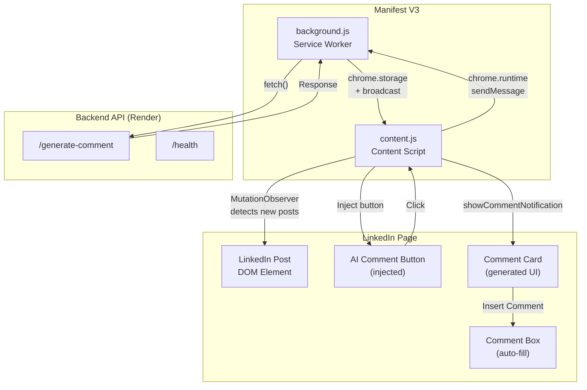
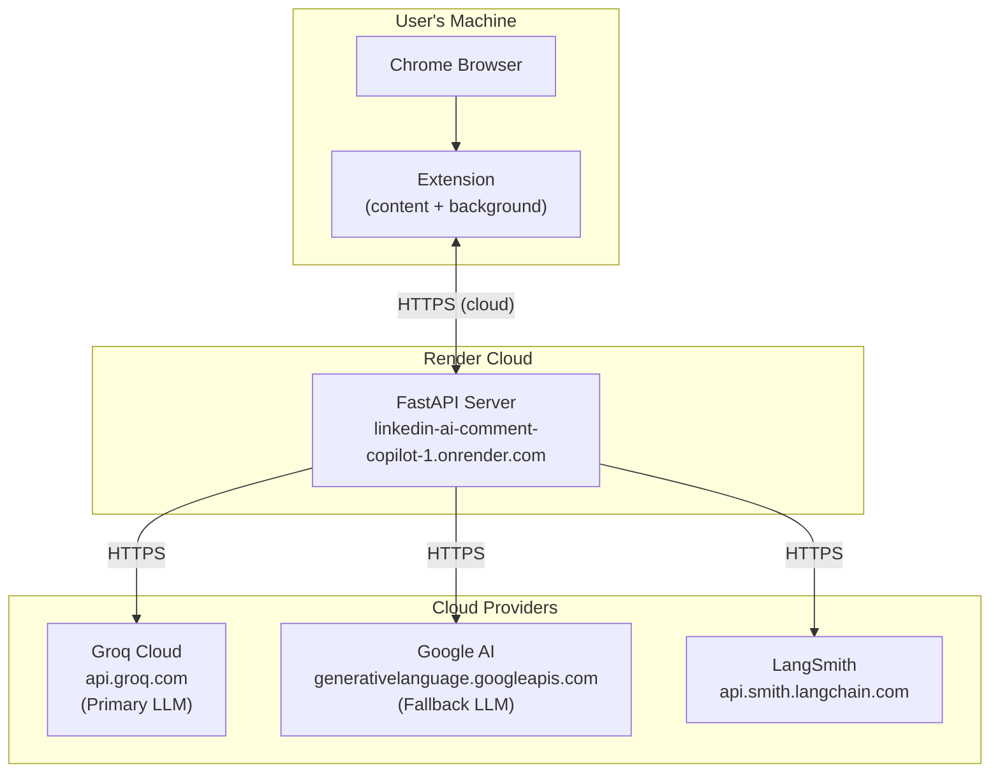

# Architecture

**LinkedIn AI Comment Copilot** — System architecture, component design, and data flow documentation.

---

## Table of Contents

1. [System Overview](#system-overview)
2. [High-Level Architecture](#high-level-architecture)
3. [Component Diagram](#component-diagram)
4. [Data Flow](#data-flow)
5. [Backend Architecture](#backend-architecture)
6. [Chrome Extension Architecture](#chrome-extension-architecture)
7. [Network Topology](#network-topology)
8. [Technology Stack](#technology-stack)

---

## System Overview

The LinkedIn AI Comment Copilot is a full-stack, real-time AI system consisting of two main components:

---

## High-Level Architecture

---

## Component Diagram

---

## Data Flow

### Request Lifecycle

### Fallback Scenario

### Data Transformations

---

## Backend Architecture

### Module Structure

### Error Handling Flow

---

## Chrome Extension Architecture

---

## Network Topology

### Deployment Details

| Component | Location | URL |
|-----------|----------|-----|
| Chrome Extension | User's browser | `chrome://extensions/` (loaded unpacked) |
| FastAPI Backend | Render Web Service | `https://linkedin-ai-comment-copilot-1.onrender.com` |
| Groq API | Cloud | `https://api.groq.com/openai/v1` |
| Google AI API | Cloud | `https://generativelanguage.googleapis.com` |
| LangSmith | Cloud | `https://api.smith.langchain.com` |

---

## Technology Stack

| Layer | Technology | Version | Purpose |
|-------|-----------|---------|---------|
| **Runtime** | Python | 3.11+ | Backend language |
| **API** | FastAPI | 0.100+ | Async HTTP framework |
| **Server** | Uvicorn | Latest | ASGI server |
| **AI Framework** | LangGraph | Latest | Multi-agent orchestration |
| **LLM SDK** | LangChain + LiteLLM | Latest | LLM abstraction + routing |
| **LLM Router** | ChatLiteLLMRouter | Latest | Automatic model fallback |
| **Validation** | Pydantic | 2.x | Data schemas |
| **Observability** | LangSmith | Latest | Tracing & monitoring |
| **LLM (Primary)** | Llama 3.3 70B | - | Meta open-source models via Groq |
| **LLM (Fallback)** | Gemini 2.5 Flash | - | Google AI models |
| **Inference** | Groq Cloud | - | Ultra-fast LLM inference |
| **Deployment** | Render | - | Cloud hosting |
| **Extension** | Chrome MV3 | - | Browser extension standard |
| **Frontend** | Vanilla JS | ES2022 | Content script + background worker |

---

*Last updated: June 2026*
