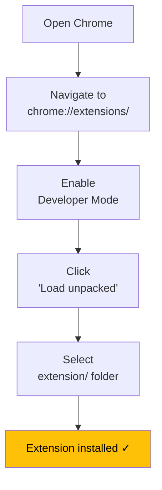

# Environment Setup

**LinkedIn AI Comment Copilot** — Complete guide to environment variables, API keys, and local development setup.

---

## Table of Contents

1. [Prerequisites](#prerequisites)
2. [Environment Variables](#environment-variables)
3. [API Key Setup](#api-key-setup)
4. [Backend Setup](#backend-setup)
5. [Extension Setup](#extension-setup)
6. [Verification](#verification)

---

## Prerequisites

| Requirement | Version | Purpose |
|-------------|---------|---------|
| Python | 3.11+ | Backend runtime |
| Google Chrome | Latest | Extension host |
| pip | Latest | Package installer |
| Git | Latest | Version control |

---

## Environment Variables

### Required Variables

| Variable | Provider | Description | Get yours at |
|----------|----------|-------------|-------------|
| `GOOGLE_API_KEY` | Google AI | API key for Gemini 2.5 Flash (Analyzer + Planner) | [aistudio.google.com/apikey](https://aistudio.google.com/apikey) |
| `GROQ_API_KEY` | Groq | API key for Llama 3.3 70B (Writer + Reviewer) | [console.groq.com/keys](https://console.groq.com/keys) |

### Optional Variables

| Variable | Provider | Default | Description |
|----------|----------|---------|-------------|
| `LANGSMITH_API_KEY` | LangSmith | None | Enables request tracing & observability |
| `LANGSMITH_PROJECT` | LangSmith | `linkedin-ai-comment-copilot` | LangSmith project name |
| `LANGSMITH_ENDPOINT` | LangSmith | `https://api.smith.langchain.com` | LangSmith API endpoint |
| `HOST` | Server | `0.0.0.0` | Backend server bind host |
| `PORT` | Server | `8000` | Backend server bind port |

---

## API Key Setup

### 1. Google AI API Key (Required)


**Steps:**
1. Visit [aistudio.google.com/apikey](https://aistudio.google.com/apikey)
2. Sign in with your Google account
3. Click **"Create API Key"**
4. Select or create a project
5. Copy the generated key
6. Add to `backend/.env`:
   ```env
   GOOGLE_API_KEY=AIzaSy...your_key_here
   ```

**Free tier**: 15 requests/minute, 1,500 requests/day

---

### 2. Groq API Key (Required)


**Steps:**
1. Visit [console.groq.com/keys](https://console.groq.com/keys)
2. Sign up or log in
3. Click **"Create API Key"**
4. Name your key (e.g., "linkedin-copilot")
5. Copy the generated key
6. Add to `backend/.env`:
   ```env
   GROQ_API_KEY=gsk_...your_key_here
   ```

**Free tier**: 30 requests/minute, 14,400 requests/day

---

### 3. LangSmith API Key (Optional)


**Steps:**
1. Visit [smith.langchain.com](https://smith.langchain.com)
2. Sign up or log in
3. Go to **Settings** → **API Keys**
4. Click **"Create API Key"**
5. Copy the key
6. Add to `backend/.env`:
   ```env
   LANGSMITH_API_KEY=ls_...your_key_here
   LANGSMITH_PROJECT=linkedin-ai-comment-copilot
   ```

---

## Backend Setup

### Step-by-Step

```bash
# 1. Clone the repository
git clone https://github.com/himanshu231204/linkedin-ai-comment-copilot.git
cd linkedin-ai-comment-copilot

# 2. Navigate to backend
cd backend

# 3. Create virtual environment
python -m venv venv

# 4. Activate virtual environment
# Windows:
venv\Scripts\activate
# macOS/Linux:
source venv/bin/activate

# 5. Install dependencies
pip install -r requirements.txt

# 6. Create environment file
cp .env.example .env

# 7. Edit .env with your API keys (see above)

# 8. Test model connectivity
cd ..  # back to project root
python -m backend.test_models

# 9. Start the server
cd backend
uvicorn main:app --reload --host 0.0.0.0 --port 8000
```

### Complete .env File

```env
# ===========================================
# LinkedIn AI Comment Copilot - .env
# ===========================================

# Required: Google AI (Analyzer + Planner)
GOOGLE_API_KEY=AIzaSy...your_google_key

# Required: Groq (Writer + Reviewer)
GROQ_API_KEY=gsk_...your_groq_key

# Optional: LangSmith tracing
LANGSMITH_API_KEY=ls_...your_langsmith_key
LANGSMITH_PROJECT=linkedin-ai-comment-copilot
# LANGSMITH_ENDPOINT=https://api.smith.langchain.com

# Optional: Server config
# HOST=0.0.0.0
# PORT=8000
```

---

## Extension Setup



**Steps:**
1. Open Google Chrome
2. Navigate to `chrome://extensions/`
3. Enable **Developer mode** (toggle in top-right)
4. Click **"Load unpacked"**
5. Select the `extension/` folder from this project
6. The extension icon appears in your toolbar

### After Extension Updates

1. Go to `chrome://extensions/`
2. Click the **refresh icon** on the extension card
3. Reload any open LinkedIn pages

---

## Verification

### 1. Health Check

```bash
curl http://localhost:8000/health
```

Expected response:
```json
{"status": "healthy"}
```

### 2. Model Connectivity Test

```bash
python -m backend.test_models
```

Expected output:
```
============================================================
  LinkedIn AI Comment Copilot - Model Test
============================================================
  [+] Analyzer  (Gemini 2.5 Flash): PASS
  [+] Planner   (Gemini 2.5 Flash): PASS
  [+] Writer    (Llama 3.3 70B - Groq): PASS
  [+] Reviewer  (Llama 3.3 70B - Groq): PASS

  Total: 4 passed, 0 failed
============================================================
```

### 3. Generate Comment Test

```bash
curl -X POST http://localhost:8000/generate-comment ^
  -H "Content-Type: application/json" ^
  -d "{\"post_content\": \"Excited to start my new role at Google!\", \"tone\": \"professional\"}"
```

### 4. LangSmith Verification

If LangSmith is configured, visit [smith.langchain.com](https://smith.langchain.com) and select the `linkedin-ai-comment-copilot` project. You should see traces for each API call.

---

## Troubleshooting

### Windows DNS Resolution Issue

**Symptom:** `Cannot connect to host ... Could not contact DNS servers`

**Cause:** The `aiodns` package (used by aiohttp for async DNS) has compatibility issues on Windows.

**Fix:**
```bash
pip uninstall aiodns pycares -y
```

This forces aiohttp to use the system DNS resolver instead.

### LangSmith Warning

**Symptom:** `WARNING: LANGSMITH_API_KEY not set - LangSmith tracing disabled`

**Fix:** Ensure your `.env` uses the new `LANGSMITH_*` variable names (not the deprecated `LANGCHAIN_*` names):
```env
LANGSMITH_API_KEY=your_key_here
LANGSMITH_PROJECT=linkedin-ai-comment-copilot
```

### API Returns 500 Error

**Check:**
1. API keys are set in `.env`
2. Both Google AI and Groq APIs are accessible from your network
3. Run `python -m backend.test_models` to verify connectivity

---

*Last updated: June 2026*
