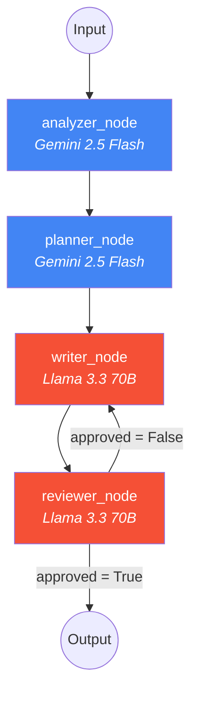
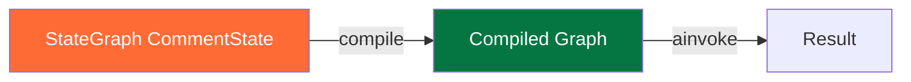
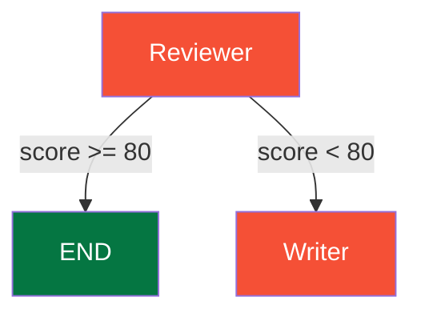
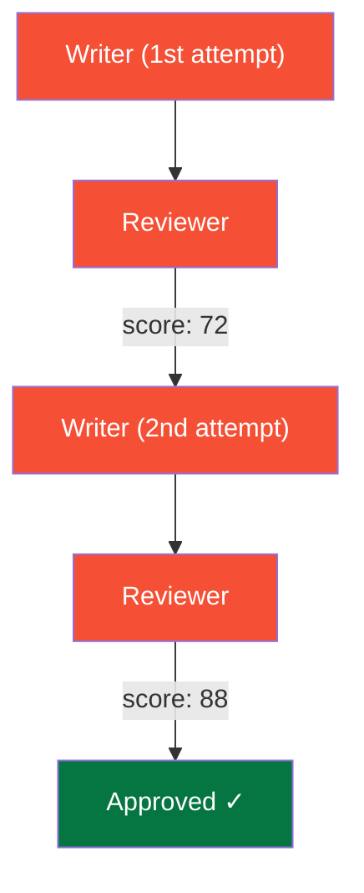
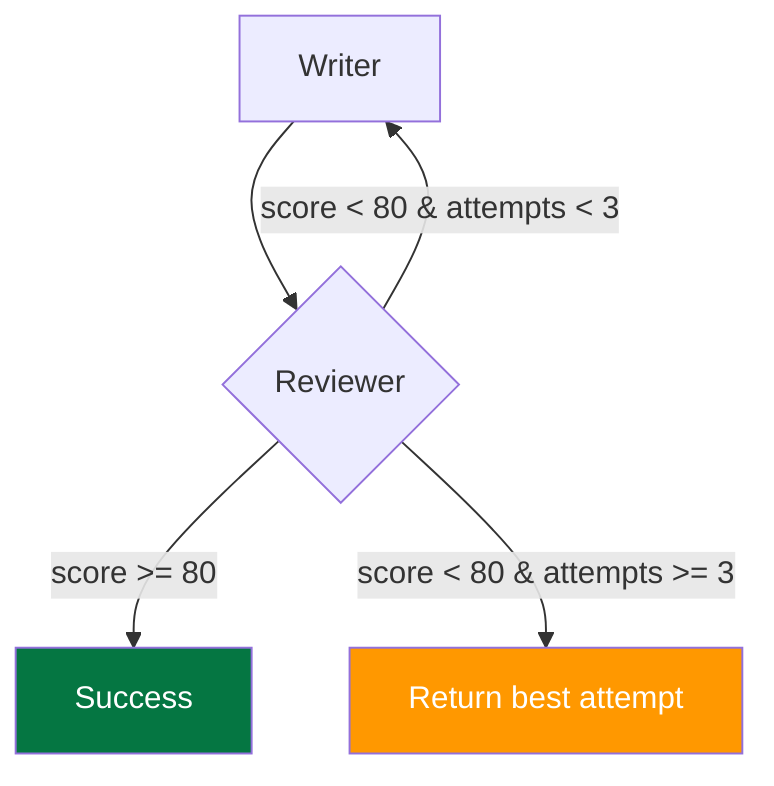

# LangGraph Workflow

**LinkedIn AI Comment Copilot** — Detailed documentation of the LangGraph multi-agent pipeline, state management, node implementations, and conditional routing.

---

## Table of Contents

1. [Overview](#overview)
2. [Graph Definition](#graph-definition)
3. [State Schema](#state-schema)
4. [Nodes](#nodes)
5. [Conditional Routing](#conditional-routing)
6. [Agent Implementations](#agent-implementations)
7. [Error Handling](#error-handling)
8. [Performance](#performance)

---

## Overview

The comment generation pipeline is built with **LangGraph**, a library for building stateful, multi-step AI workflows as directed graphs. Each agent is a **node** in the graph, and the state flows between nodes as a typed dictionary.



---

## Graph Definition

```python
# backend/graph/comment_graph.py

from langgraph.graph import StateGraph, END

def create_comment_graph() -> StateGraph:
    workflow = StateGraph(CommentState)

    # Add nodes
    workflow.add_node("analyzer", analyzer_node)
    workflow.add_node("planner", planner_node)
    workflow.add_node("writer", writer_node)
    workflow.add_node("reviewer", reviewer_node)

    # Set entry point
    workflow.set_entry_point("analyzer")

    # Add edges
    workflow.add_edge("analyzer", "planner")
    workflow.add_edge("planner", "writer")
    workflow.add_edge("writer", "reviewer")

    # Add conditional edges (reviewer -> writer or end)
    workflow.add_conditional_edges(
        "reviewer",
        should_regenerate,
        {
            "writer": "writer",  # Reject -> regenerate
            "end": END,          # Approve -> done
        },
    )

    return workflow.compile()
```

### Graph Compilation



---

## State Schema

The `CommentState` TypedDict is the single source of truth for the entire workflow:

```python
class CommentState(TypedDict):
    # === Input Fields ===
    post_content: str           # Raw LinkedIn post text
    tone: str                   # Selected comment tone

    # === Analyzer Output ===
    post_type: str              # "internship", "achievement", etc.
    category: str               # "career", "technical", etc.
    sentiment: str              # "positive", "neutral", "negative"

    # === Planner Output ===
    strategy: str               # Comment strategy instructions

    # === Writer Output ===
    generated_comment: str      # The generated comment text

    # === Reviewer Output ===
    review_score: int           # Quality score 0-100
    approved: bool              # Pass/fail decision

    # === Final Output ===
    final_comment: str          # Approved comment (or empty)

    # === Metadata ===
    llm_config: dict            # Serialized LLM config for tracing
```

### State Flow Diagram

```mermaid
graph TD
    subgraph "Input"
        IN1["post_content"]
        IN2["tone"]
    end

    subgraph "After Analyzer"
        A1["post_type"]
        A2["category"]
        A3["sentiment"]
    end

    subgraph "After Planner"
        P1["strategy"]
    end

    subgraph "After Writer"
        W1["generated_comment"]
    end

    subgraph "After Reviewer"
        R1["review_score"]
        R2["approved"]
        R3["final_comment"]
    end

    IN1 + IN2 --> A1 + A2 + A3
    A1 + A2 + A3 + IN2 --> P1
    IN1 + IN2 + P1 --> W1
    IN1 + W1 + IN2 --> R1 + R2 + R3
```

---

## Nodes

### Node 1: Analyzer

**Model**: Gemini 2.5 Flash (Google AI)
**Input**: `post_content`
**Output**: `post_type`, `category`, `sentiment`
**Parser**: `JsonOutputParser`

```python
async def analyzer_node(state: CommentState) -> CommentState:
    llm_config = get_analyzer_llm_config()
    result = await analyze_post(state["post_content"], llm_config)

    return {
        **state,
        "post_type": result.get("post_type", "unknown"),
        "category": result.get("category", "general"),
        "sentiment": result.get("sentiment", "neutral"),
        "llm_config": llm_config.model_dump(),
    }
```

**Classification Taxonomy**:

| Post Type | Examples |
|-----------|----------|
| `internship` | Starting a new internship at... |
| `job_update` | Just got promoted to... |
| `promotion` | Excited to announce my promotion |
| `achievement` | Reached a milestone of... |
| `project_showcase` | Just shipped a new project... |
| `open_source` | Released a new library... |
| `research` | Published a paper on... |
| `startup` | Launched my startup... |
| `hackathon` | Won a hackathon... |
| `hiring` | We're hiring! |

---

### Node 2: Planner

**Model**: Gemini 2.5 Flash (Google AI)
**Input**: `post_type`, `category`, `tone`
**Output**: `strategy`
**Parser**: `JsonOutputParser`

```python
async def planner_node(state: CommentState) -> CommentState:
    llm_config = get_planner_llm_config()
    result = await plan_strategy(
        state["post_type"],
        state["category"],
        state["tone"],
        llm_config,
    )

    return {
        **state,
        "strategy": result.get("strategy", "write a relevant comment"),
        "llm_config": llm_config.model_dump(),
    }
```

**Strategy Examples**:

| Post Type | Tone | Strategy |
|-----------|------|----------|
| `achievement` | `professional` | "Congratulate professionally and mention the impact" |
| `project_showcase` | `technical` | "Ask about the tech stack and architecture decisions" |
| `job_update` | `supportive` | "Express genuine excitement and wish success" |
| `startup` | `founder` | "Share relevant founder perspective and ask about traction" |

---

### Node 3: Writer

**Model**: Llama 3.3 70B Versatile (Groq)
**Input**: `post_content`, `tone`, `strategy`
**Output**: `generated_comment`
**Parser**: `StrOutputParser`

```python
async def writer_node(state: CommentState) -> CommentState:
    llm_config = get_writer_llm_config()
    comment = await write_comment(
        state["post_content"],
        state["tone"],
        state["strategy"],
        llm_config,
    )

    return {
        **state,
        "generated_comment": comment,
        "llm_config": llm_config.model_dump(),
    }
```

**Writing Rules**:
- 1-3 lines, maximum 60 words
- Sound human, not robotic
- No cringe, no excessive emojis
- No hashtags, no "Great post!"
- Match tone exactly
- Reference specific details from the post

---

### Node 4: Reviewer

**Model**: Llama 3.3 70B Versatile (Groq)
**Input**: `post_content`, `generated_comment`, `tone`
**Output**: `approved`, `review_score`, `final_comment`
**Parser**: `JsonOutputParser`

```python
async def reviewer_node(state: CommentState) -> CommentState:
    llm_config = get_reviewer_llm_config()
    result = await review_comment(
        state["post_content"],
        state["generated_comment"],
        state["tone"],
        llm_config,
    )

    approved = result.get("approved", False)
    score = result.get("score", 0)

    return {
        **state,
        "review_score": score,
        "approved": approved,
        "final_comment": state["generated_comment"] if approved else "",
        "llm_config": llm_config.model_dump(),
    }
```

**Review Criteria**:

| Criterion | Weight | Description |
|-----------|--------|-------------|
| Relevance | 20% | Directly relates to the post content |
| Human-likeness | 25% | Sounds natural, not AI-generated |
| Spam Score | 20% | Low spam indicators (inverted) |
| Generic Score | 15% | Not a template/generic response (inverted) |
| Professionalism | 20% | Appropriate for LinkedIn |

**Threshold**: Overall score >= 80 for approval.

---

## Conditional Routing

```python
def should_regenerate(state: CommentState) -> Literal["writer", "end"]:
    if state["approved"]:
        return "end"
    return "writer"
```



**Regeneration Flow**:



---

## Agent Implementations

### analyze_post()

```python
async def analyze_post(post_content: str, config: LLMConfig) -> dict:
    llm = create_llm(config)
    prompt = ANALYZER_PROMPT
    chain = prompt | llm | JsonOutputParser()
    return await chain.ainvoke({"post_content": post_content})
```

### plan_strategy()

```python
async def plan_strategy(post_type: str, category: str, tone: str, config: LLMConfig) -> dict:
    llm = create_llm(config)
    prompt = PLANNER_PROMPT
    chain = prompt | llm | JsonOutputParser()
    return await chain.ainvoke({
        "post_type": post_type,
        "category": category,
        "tone": tone,
    })
```

### write_comment()

```python
async def write_comment(post_content: str, tone: str, strategy: str, config: LLMConfig) -> str:
    llm = create_llm(config)
    prompt = WRITER_PROMPT
    chain = prompt | llm | StrOutputParser()
    return await chain.ainvoke({
        "post_content": post_content,
        "tone": tone,
        "strategy": strategy,
    })
```

### review_comment()

```python
async def review_comment(post_content: str, generated_comment: str, tone: str, config: LLMConfig) -> dict:
    llm = create_llm(config)
    prompt = REVIEWER_PROMPT
    chain = prompt | llm | JsonOutputParser()
    return await chain.ainvoke({
        "post_content": post_content,
        "generated_comment": generated_comment,
        "tone": tone,
    })
```

---

## Error Handling

| Error | Node | Handling |
|-------|------|----------|
| LLM timeout | Any | FastAPI catches, returns 500 |
| JSON parse error | Analyzer/Planner/Reviewer | Default values used, workflow continues |
| Empty response | Writer | Regenerated on next attempt |
| Reviewer rejects | Reviewer | Loops back to Writer |
| Missing API key | All | `ValueError` raised at startup |

### Retry Logic

The graph has built-in retry via the Reviewer -> Writer loop:



---

## Performance

### Latency Breakdown (typical)

| Node | Model | Avg Latency |
|------|-------|-------------|
| Analyzer | Gemini 2.5 Flash | ~0.5-1s |
| Planner | Gemini 2.5 Flash | ~0.3-0.8s |
| Writer | Llama 3.3 70B (Groq) | ~0.5-1.5s |
| Reviewer | Llama 3.3 70B (Groq) | ~0.5-1s |
| **Total (no retry)** | | **~2-4s** |
| **Total (1 retry)** | | **~3.5-6.5s** |

### Optimization

- **Temperature tuning** reduces retries (lower temp = more consistent output)
- **Token limits** prevent runaway generation
- **Groq inference** provides sub-second LLM response times
- **Async execution** allows concurrent API handling

---

*Last updated: June 2026*
