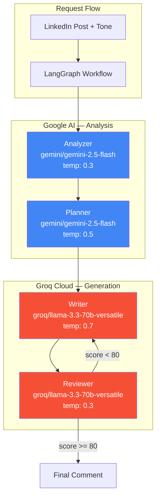
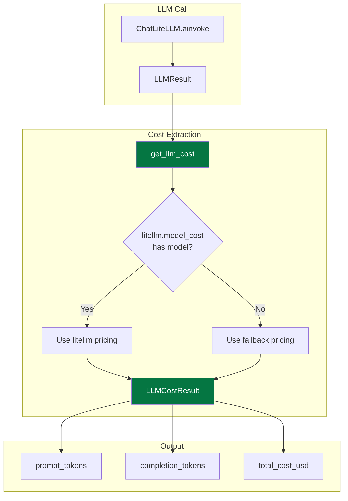
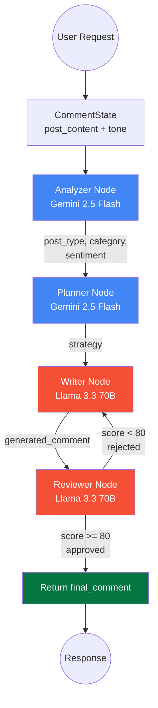
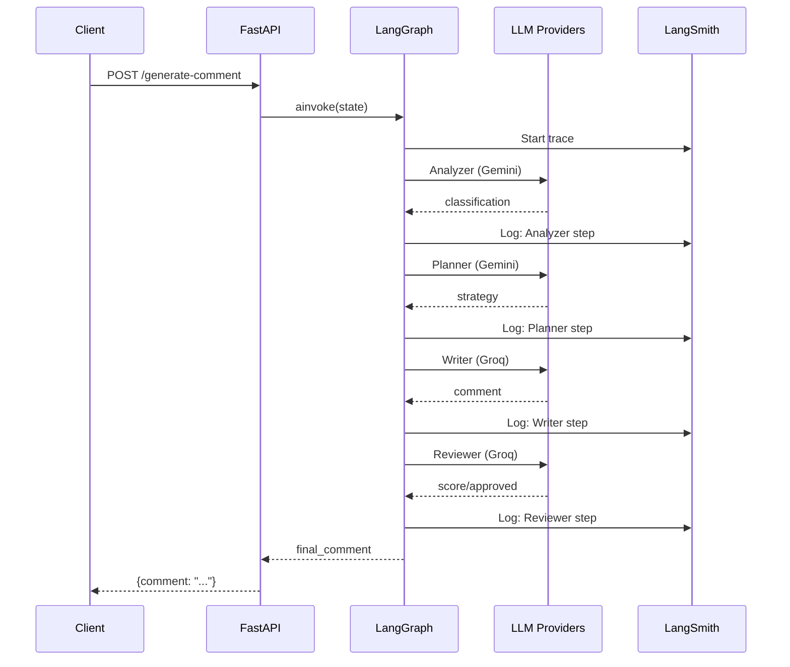

# Model & LLM Integration

**LinkedIn AI Comment Copilot** — Complete guide to the multi-provider LLM layer, per-agent model routing, and LangGraph agent architecture.

---

## Table of Contents

1. [Overview](#overview)
2. [Model Architecture](#model-architecture)
3. [Provider Configuration](#provider-configuration)
4. [Agent Model Assignment](#agent-model-assignment)
5. [LLM Configuration](#llm-configuration)
6. [Cost Tracking](#cost-tracking)
7. [LangGraph Workflow](#langgraph-workflow)
8. [Prompts](#prompts)
9. [Observability](#observability)
10. [Environment Variables](#environment-variables)
11. [Troubleshooting](#troubleshooting)

---

## Overview

The backend uses a **multi-provider LLM architecture** with two providers:

| Provider | Models | Purpose |
|----------|--------|---------|
| **Google AI** | Gemini 2.5 Flash | Post analysis & strategy planning (fast, accurate) |
| **Groq Cloud** | Llama 3.3 70B Versatile | Comment writing & quality review (high-quality generation) |

Both are integrated via **LiteLLM** (universal LLM proxy) and orchestrated through a **LangGraph** multi-agent workflow. LangSmith provides full observability.

### Design Rationale

```
Why two providers?
├── Gemini 2.5 Flash — Best at structured classification tasks
│   ├── Fast inference (< 1s)
│   ├── Excellent JSON output
│   └── Cost-effective for high-volume analysis
│
└── Llama 3.3 70B Versatile — Best at creative generation
    ├── Human-like writing quality
    ├── Strong reasoning for quality review
    └── Low latency via Groq's inference stack
```

---

## Model Architecture



---

## Provider Configuration

### Google AI (Gemini)

- **Base URL**: Default (managed by LiteLLM)
- **Auth**: `GOOGLE_API_KEY` environment variable
- **Models**: `gemini/gemini-2.5-flash`
- **SDK**: LangChain LiteLLM with automatic provider detection

```python
ChatLiteLLM(
    model="gemini/gemini-2.5-flash",
    temperature=0.3,
    max_tokens=200,
    api_key=os.getenv("GOOGLE_API_KEY"),
)
```

### Groq Cloud (Llama 3.3)

- **Base URL**: Default (managed by LiteLLM)
- **Auth**: `GROQ_API_KEY` environment variable
- **Models**: `groq/llama-3.3-70b-versatile`
- **SDK**: LangChain LiteLLM with automatic provider detection

```python
ChatLiteLLM(
    model="groq/llama-3.3-70b-versatile",
    temperature=0.7,
    max_tokens=500,
    api_key=os.getenv("GROQ_API_KEY"),
)
```

---

## Agent Model Assignment

| Agent | Model | Provider | Temp | Max Tokens | Why This Model |
|-------|-------|----------|------|------------|----------------|
| **Analyzer** | `gemini/gemini-2.5-flash` | Google AI | 0.3 | 200 | Fast, accurate JSON classification |
| **Planner** | `gemini/gemini-2.5-flash` | Google AI | 0.5 | 200 | Quick strategy determination |
| **Writer** | `groq/llama-3.3-70b-versatile` | Groq | 0.7 | 500 | Human-like comment generation |
| **Reviewer** | `groq/llama-3.3-70b-versatile` | Groq | 0.3 | 300 | Critical quality evaluation |

### Temperature Rationale

| Agent | Temp | Reason |
|-------|------|--------|
| Analyzer | 0.3 | Deterministic classification — same post = same type |
| Planner | 0.5 | Slight creativity in strategy while staying on-target |
| Writer | 0.7 | Natural variation — regenerate produces different comments |
| Reviewer | 0.3 | Strict evaluation — consistent scoring |

---

## LLM Configuration

### LLMConfig Model

Defined in `backend/models/llm.py`:

```python
class LLMConfig(BaseModel):
    model_name: str              # "gemini/gemini-2.5-flash" or "groq/llama-3.3-70b-versatile"
    temperature: float           # 0.0 - 2.0
    max_tokens: int              # 1 - 4000
    api_key: str                 # Provider API key
    base_url: Optional[str]      # Custom base URL (optional)
    source_domain: Optional[str] # X-Source header
    session_id: Optional[str]    # Session tracking
    enable_reasoning: bool       # Enable reasoning mode
    reasoning_effort: Optional[str]  # "low", "medium", "high"
    custom_llm_provider: Optional[str]  # LiteLLM provider override
```

### Factory Functions

| Function | Model | Use Case |
|----------|-------|----------|
| `get_analyzer_llm_config()` | Gemini 2.5 Flash | Analyzer agent |
| `get_planner_llm_config()` | Gemini 2.5 Flash | Planner agent |
| `get_writer_llm_config()` | Llama 3.3 70B (Groq) | Writer agent |
| `get_reviewer_llm_config()` | Llama 3.3 70B (Groq) | Reviewer agent |
| `get_default_llm_config()` | Gemini 2.5 Flash | Alias for analyzer |
| `get_premium_llm_config()` | Llama 3.3 70B (Groq) | Alias for writer |

### create_llm()

Creates a `ChatLiteLLM` instance from config:

```python
def create_llm(config: LLMConfig, callbacks=None) -> ChatLiteLLM:
    kwargs = {
        "model": config.model_name,
        "temperature": config.temperature,
        "max_tokens": config.max_tokens,
        "api_key": config.api_key,
    }
    # Add optional fields only when set
    if config.base_url:
        kwargs["api_base"] = config.base_url
    return ChatLiteLLM(**kwargs)
```

---

## Cost Tracking

The backend includes built-in LLM cost measurement. Every LLM call can be tracked for token usage and USD cost using LiteLLM's pricing database.

### Architecture



### Key Components

#### `LLMCostResult` Dataclass

Defined in `backend/models/llm.py`:

```python
@dataclass
class LLMCostResult:
    model: str = ""
    prompt_tokens: int = 0
    completion_tokens: int = 0
    total_tokens: int = 0
    input_cost_usd: float = 0.0
    output_cost_usd: float = 0.0
    total_cost_usd: float = 0.0
```

#### `get_llm_cost()` Function

Extracts token usage from a LangChain `LLMResult` and computes cost:

```python
def get_llm_cost(response: LLMResult, model_name: str) -> LLMCostResult:
    """Extract token usage from a LangChain LLMResult and compute cost."""
    # Extracts from response.llm_output["token_usage"]
    # Looks up pricing via litellm.model_cost or fallback table
    # Returns LLMCostResult with USD costs
```

#### `LLMCallbackHandler`

Automatic cost tracking when used as a LangChain callback:

```python
handler = LLMCallbackHandler()
handler.set_model_name("gemini/gemini-2.5-flash")
llm = create_llm(config, callbacks=[handler])
await llm.ainvoke(messages)
print(handler.last_cost.total_cost_usd)
```

### Pricing Table

Cost is calculated using:

1. **Primary**: `litellm.model_cost` — LiteLLM's built-in pricing database (auto-updated)
2. **Fallback**: Hardcoded prices for the models used in this project

| Model | Input (per 1M tokens) | Output (per 1M tokens) |
|-------|----------------------|------------------------|
| `gemini/gemini-2.5-flash` | $0.15 | $0.60 |
| `groq/llama-3.3-70b-versatile` | $0.59 | $0.79 |

### REST API Endpoint

```
POST /test-cost?agent={agent}
```

See [API Reference](API_REFERENCE.md#post-test-cost) for full documentation.

---

## LangGraph Workflow



### State Schema

```python
class CommentState(TypedDict):
    post_content: str       # Input: LinkedIn post text
    tone: str               # Input: Desired comment tone
    post_type: str          # Analyzer output
    category: str           # Analyzer output
    sentiment: str          # Analyzer output
    strategy: str           # Planner output
    generated_comment: str  # Writer output
    review_score: int       # Reviewer output (0-100)
    approved: bool          # Reviewer output
    final_comment: str      # Final approved comment
    llm_config: dict        # Current LLM config (serialized)
```

---

## Prompts

### Analyzer (Gemini 2.5 Flash)

```
System: You are an expert LinkedIn post analyzer.
Classify the post into:
  - post_type: internship, job_update, promotion, achievement, etc.
  - category: career, technical, personal, company, learning
  - sentiment: positive, neutral, negative

Human: Analyze this LinkedIn post:
  {post_content}
  Return JSON with: post_type, category, sentiment
```

### Planner (Gemini 2.5 Flash)

```
System: You are a comment strategy planner.
Determine the best strategy for:
  - What angle to take
  - What key points to address
  - How to match the requested tone

Human: Post type: {post_type}, Category: {category}, Tone: {tone}
  Return JSON with: strategy
```

### Writer (Llama 3.3 70B — Groq)

```
System: You are an expert LinkedIn comment writer. Rules:
  - Sound human, not robotic
  - No cringe, no excessive emojis
  - 1-3 lines, max 60 words
  - No hashtags, no "Great post!"
  - Match tone exactly

Human: Post: {post_content}, Tone: {tone}, Strategy: {strategy}
  Write the comment:
```

### Reviewer (Llama 3.3 70B — Groq)

```
System: You are a LinkedIn comment quality reviewer.
Score 0-100 on:
  1. relevance
  2. human_likeness
  3. spam_score (inverted)
  4. generic_score (inverted)
  5. professionalism
  Overall = average. Approved if >= 80.

Human: Post: {post_content}, Comment: {generated_comment}, Tone: {tone}
  Return JSON with: approved, score, feedback
```

---

## Observability

### LangSmith Integration

When `LANGSMITH_API_KEY` is set, all LangChain/LangGraph calls are automatically traced.



**Trace URL**: https://smith.langchain.com

---

## Environment Variables

| Variable | Required | Provider | Description |
|----------|----------|----------|-------------|
| `GOOGLE_API_KEY` | Yes | Google AI | API key for Gemini models |
| `GROQ_API_KEY` | Yes | Groq | API key for Llama 3.3 models |
| `LANGSMITH_API_KEY` | No | LangSmith | Tracing & observability |
| `LANGSMITH_PROJECT` | No | LangSmith | Project name (default: `linkedin-ai-comment-copilot`) |
| `LANGSMITH_ENDPOINT` | No | LangSmith | API endpoint (default: `https://api.smith.langchain.com`) |
| `HOST` | No | Server | Bind host (default: `0.0.0.0`) |
| `PORT` | No | Server | Bind port (default: `8000`) |

---

## Troubleshooting

### Test Model Connectivity

```bash
# Run from project root
python -m backend.test_models
```

### Common Issues

| Issue | Symptom | Cause | Fix |
|-------|---------|-------|-----|
| Missing Google key | `GOOGLE_API_KEY not set` | Env var not configured | Add to `.env` |
| Missing Groq key | `GROQ_API_KEY not set` | Env var not configured | Add to `.env` |
| Gemini 403 | `Permission denied` | Invalid or expired key | Regenerate at [aistudio.google.com](https://aistudio.google.com/apikey) |
| Groq 401 | `Invalid API key` | Wrong key format | Check key at [console.groq.com](https://console.groq.com/keys) |
| Groq 429 | `Rate limited` | Too many requests | Wait and retry (free tier has limits) |
| Empty comment | `comment: ""` | Reviewer rejected all attempts | Check prompts, increase max_tokens |
| JSON parse error | `ValidationError` | LLM returned non-JSON | Reviewer agent handles this internally |

### Debug Logging

```python
import logging
logging.basicConfig(level=logging.DEBUG)
```

---

## File Reference

```
backend/
├── models/
│   ├── __init__.py
│   ├── llm.py                    # LLMConfig, create_llm, cost tracking, provider configs
│   └── model_router.py           # Model selection utilities, technical keywords
├── agents/
│   ├── __init__.py
│   ├── analyzer.py               # Post classification agent (Gemini)
│   ├── planner.py                # Strategy planning agent (Gemini)
│   ├── writer.py                 # Comment writing agent (Groq/Llama)
│   └── reviewer.py               # Quality review agent (Groq/Llama)
├── graph/
│   ├── __init__.py
│   └── comment_graph.py          # LangGraph workflow definition
├── prompts/
│   ├── __init__.py
│   ├── analyzer_prompt.py        # Analyzer prompt template
│   ├── planner_prompt.py         # Planner prompt template
│   ├── writer_prompt.py          # Writer prompt template
│   └── reviewer_prompt.py        # Reviewer prompt template
├── schemas/
│   ├── __init__.py
│   ├── request.py                # GenerateCommentRequest
│   └── response.py               # GenerateCommentResponse, HealthResponse
├── main.py                       # FastAPI + LangSmith configuration
├── test_models.py                # Model connectivity test script
├── requirements.txt              # Python dependencies
└── .env.example                  # Environment variable template
```

---

*Last updated: June 2026*
