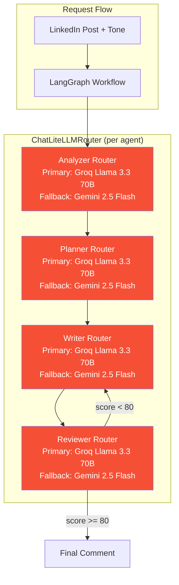
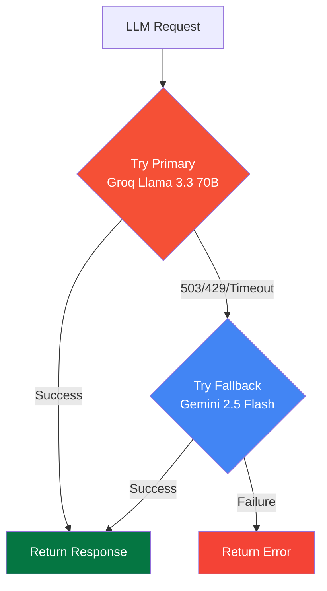
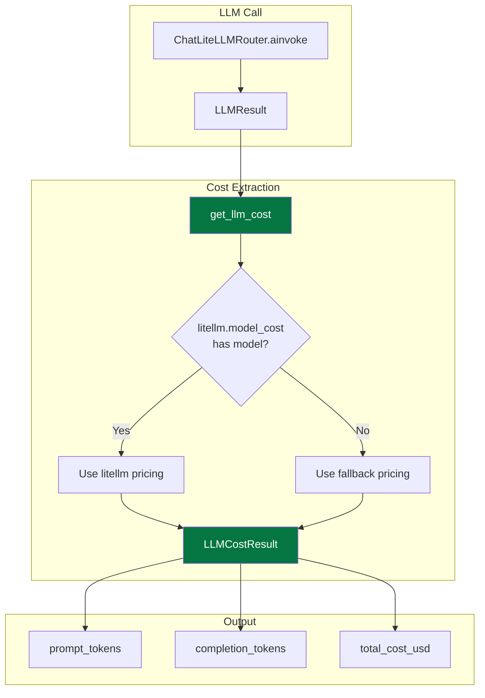
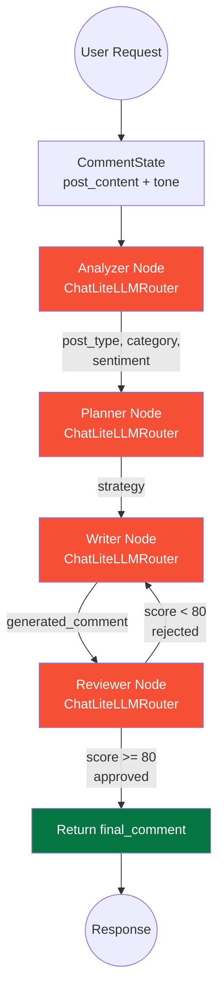
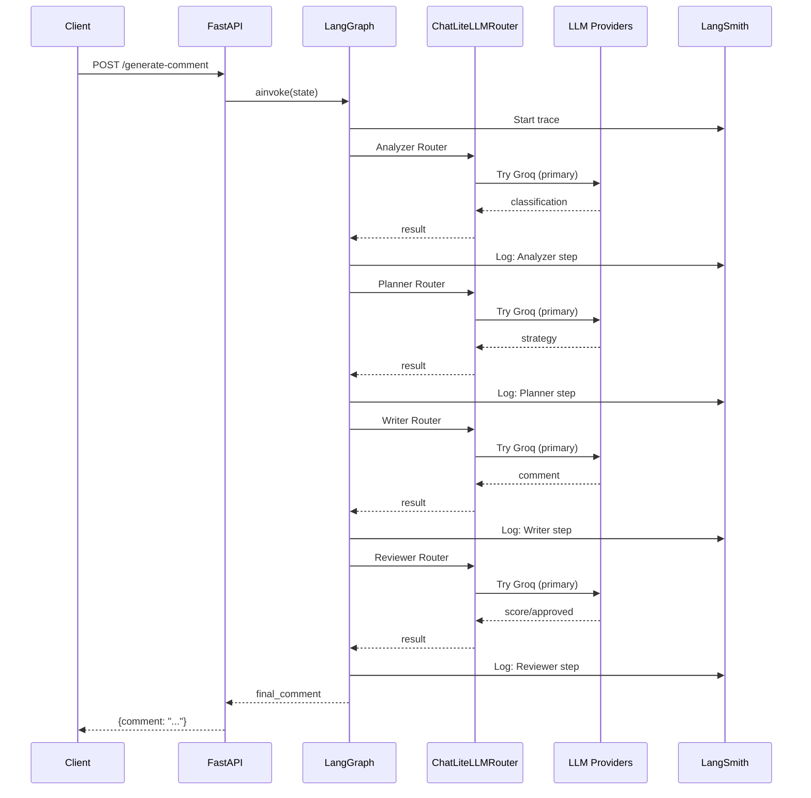

# Model & LLM Integration

**LinkedIn AI Comment Copilot** — Complete guide to the multi-provider LLM layer, ChatLiteLLMRouter automatic fallback, per-agent model routing, and LangGraph agent architecture.

---

## Table of Contents

1. [Overview](#overview)
2. [Model Architecture](#model-architecture)
3. [Provider Configuration](#provider-configuration)
4. [ChatLiteLLMRouter (Automatic Fallback)](#chatlitellmrouter-automatic-fallback)
5. [Agent Model Assignment](#agent-model-assignment)
6. [LLM Configuration](#llm-configuration)
7. [Cost Tracking](#cost-tracking)
8. [LangGraph Workflow](#langgraph-workflow)
9. [Prompts](#prompts)
10. [Observability](#observability)
11. [Environment Variables](#environment-variables)
12. [Troubleshooting](#troubleshooting)

---

## Overview

The backend uses a **multi-provider LLM architecture** with **automatic fallback** powered by `ChatLiteLLMRouter`:

| Role | Primary | Fallback | Purpose |
|------|---------|----------|---------|
| **All Agents** | Groq (Llama 3.3 70B) | Google AI (Gemini 2.5 Flash) | Post analysis, strategy, writing, review |

Both providers are integrated via **LiteLLM** (universal LLM proxy) and orchestrated through a **LangGraph** multi-agent workflow. LangSmith provides full observability.

### Design Rationale

```
Why Groq as primary?
├── Reliability — Groq free tier allows 30 req/min vs Gemini's 20 req/day
├── Speed — Groq's inference stack delivers sub-second latency
├── Quality — Llama 3.3 70B handles both analysis and generation well
└── Cost — Free tier is generous for development

Why Gemini as fallback?
├── Backup when Groq hits rate limits
├── Excellent structured JSON output for classification
└── Different provider = redundant failure modes
```

---

## Model Architecture



---

## Provider Configuration

### Groq Cloud (Llama 3.3) — Primary

- **Base URL**: Default (managed by LiteLLM)
- **Auth**: `GROQ_API_KEY` environment variable (required)
- **Models**: `groq/llama-3.3-70b-versatile`
- **Free tier**: 30 requests/minute, 14,400 requests/day

```python
ChatLiteLLM(
    model="groq/llama-3.3-70b-versatile",
    temperature=0.7,
    max_tokens=500,
    api_key=os.getenv("GROQ_API_KEY"),
)
```

### Google AI (Gemini) — Fallback

- **Base URL**: Default (managed by LiteLLM)
- **Auth**: `GOOGLE_API_KEY` environment variable (optional — needed only if you want Gemini fallback)
- **Models**: `gemini/gemini-2.5-flash`
- **Free tier**: 20 requests/day (rate-limited)

```python
ChatLiteLLM(
    model="gemini/gemini-2.5-flash",
    temperature=0.3,
    max_tokens=200,
    api_key=os.getenv("GOOGLE_API_KEY"),
)
```

---

## ChatLiteLLMRouter (Automatic Fallback)

Each agent uses `ChatLiteLLMRouter` from `langchain_litellm` for automatic failover. When the primary model (Groq) returns a 503, 429, or timeout error, the router automatically retries with the fallback model (Gemini).

### How It Works



### Configuration

Each agent creates its own Router with two models:

```python
from langchain_litellm import ChatLiteLLMRouter

model_list = [
    {
        "model_name": "primary",
        "litellm_params": {
            "model": "groq/llama-3.3-70b-versatile",
            "api_key": os.getenv("GROQ_API_KEY"),
            "temperature": 0.7,
            "max_tokens": 500,
        },
    },
    {
        "model_name": "fallback",
        "litellm_params": {
            "model": "gemini/gemini-2.5-flash",
            "api_key": os.getenv("GOOGLE_API_KEY"),
            "temperature": 0.3,
            "max_tokens": 200,
        },
    },
]

router = ChatLiteLLMRouter(
    model_list=model_list,
    fallbacks=[{"primary": ["fallback"]}],
    num_retries=2,
    retry_after=0.5,
    timeout=30,
    local_model_cost_map=True,
)
```

### Router Parameters

| Parameter | Value | Description |
|-----------|-------|-------------|
| `num_retries` | 2 | Retries per model before fallback |
| `retry_after` | 0.5s | Delay between retries |
| `timeout` | 30s | Max wait time per request |
| `local_model_cost_map` | True | Skip network cost lookup (avoids hangs) |

### Important: LiteLLM Telemetry

LiteLLM makes background network calls (telemetry, model cost lookup) that can cause hangs. These environment variables **must** be set before any LiteLLM imports:

```python
import os
os.environ["LITELLM_LOCAL_MODEL_COST_MAP"] = "True"
os.environ["DO_NOT_TRACK"] = "1"
```

These are set in `backend/main.py` and `backend/test_models.py`.

---

## Agent Model Assignment

All four agents now use the same model pair through ChatLiteLLMRouter:

| Agent | Primary Model | Fallback Model | Temp | Max Tokens | Router Function |
|-------|--------------|----------------|------|------------|-----------------|
| **Analyzer** | `groq/llama-3.3-70b-versatile` | `gemini/gemini-2.5-flash` | 0.3 | 200 | `create_analyzer_agent_with_router()` |
| **Planner** | `groq/llama-3.3-70b-versatile` | `gemini/gemini-2.5-flash` | 0.5 | 200 | `create_planner_agent_with_router()` |
| **Writer** | `groq/llama-3.3-70b-versatile` | `gemini/gemini-2.5-flash` | 0.7 | 500 | `create_writer_agent_with_router()` |
| **Reviewer** | `groq/llama-3.3-70b-versatile` | `gemini/gemini-2.5-flash` | 0.3 | 300 | `create_reviewer_agent_with_router()` |

### Temperature Rationale

| Agent | Temp | Reason |
|-------|------|--------|
| Analyzer | 0.3 | Deterministic classification — same post = same type |
| Planner | 0.5 | Slight creativity in strategy while staying on-target |
| Writer | 0.7 | Natural variation — regenerate produces different comments |
| Reviewer | 0.3 | Strict evaluation — consistent scoring |

---

## LLM Configuration

### Factory Functions

| Function | Model | Use Case |
|----------|-------|----------|
| `create_analyzer_agent_with_router()` | Router (Groq primary) | Analyzer agent |
| `create_planner_agent_with_router()` | Router (Groq primary) | Planner agent |
| `create_writer_agent_with_router()` | Router (Groq primary) | Writer agent |
| `create_reviewer_agent_with_router()` | Router (Groq primary) | Reviewer agent |
| `create_llm_with_router()` | Router (any config) | Generic router creation |

### Legacy Functions (still available)

| Function | Model | Use Case |
|----------|-------|----------|
| `get_analyzer_llm_config()` | Config object | Manual LLM creation |
| `get_planner_llm_config()` | Config object | Manual LLM creation |
| `get_writer_llm_config()` | Config object | Manual LLM creation |
| `get_reviewer_llm_config()` | Config object | Manual LLM creation |

### create_llm()

Creates a `ChatLiteLLM` instance from config (legacy, no fallback):

```python
def create_llm(config: LLMConfig, callbacks=None) -> ChatLiteLLM:
    kwargs = {
        "model": config.model_name,
        "temperature": config.temperature,
        "max_tokens": config.max_tokens,
        "api_key": config.api_key,
    }
    if config.base_url:
        kwargs["api_base"] = config.base_url
    return ChatLiteLLM(**kwargs)
```

### create_llm_with_router()

Creates a `ChatLiteLLMRouter` with automatic fallback:

```python
def create_llm_with_router(
    primary_model: str,
    primary_api_key: str,
    fallback_model: str,
    fallback_api_key: str,
    temperature: float = 0.7,
    max_tokens: int = 500,
) -> ChatLiteLLMRouter:
    model_list = _build_model_list(
        primary_model, primary_api_key,
        fallback_model, fallback_api_key,
        temperature, max_tokens,
    )
    return ChatLiteLLMRouter(
        model_list=model_list,
        fallbacks=[{"primary": ["fallback"]}],
        num_retries=2,
        retry_after=0.5,
        timeout=30,
        local_model_cost_map=True,
    )
```

---

## Cost Tracking

The backend includes built-in LLM cost measurement. Every LLM call can be tracked for token usage and USD cost using LiteLLM's pricing database.

### Architecture



### Key Components

#### `LLMCostResult` Dataclass

Defined in `backend/models/llm.py`:

```python
@dataclass
class LLMCostResult:
    model: str = ""
    prompt_tokens: int = 0
    completion_tokens: int = 0
    total_tokens: int = 0
    input_cost_usd: float = 0.0
    output_cost_usd: float = 0.0
    total_cost_usd: float = 0.0
```

#### `get_llm_cost()` Function

Extracts token usage from a LangChain `LLMResult` and computes cost:

```python
def get_llm_cost(response: LLMResult, model_name: str) -> LLMCostResult:
    """Extract token usage from a LangChain LLMResult and compute cost."""
    # Extracts from response.llm_output["token_usage"]
    # Looks up pricing via litellm.model_cost or fallback table
    # Returns LLMCostResult with USD costs
```

### Pricing Table

Cost is calculated using:

1. **Primary**: `litellm.model_cost` — LiteLLM's built-in pricing database (auto-updated)
2. **Fallback**: Hardcoded prices for the models used in this project

| Model | Input (per 1M tokens) | Output (per 1M tokens) |
|-------|----------------------|------------------------|
| `groq/llama-3.3-70b-versatile` | $0.59 | $0.79 |
| `gemini/gemini-2.5-flash` | $0.15 | $0.60 |

### REST API Endpoint

```
POST /test-cost?agent={agent}
```

See [API Reference](API_REFERENCE.md#post-test-cost) for full documentation.

---

## LangGraph Workflow



### State Schema

```python
class CommentState(TypedDict):
    post_content: str       # Input: LinkedIn post text
    tone: str               # Input: Desired comment tone
    post_type: str          # Analyzer output
    category: str           # Analyzer output
    sentiment: str          # Analyzer output
    strategy: str           # Planner output
    generated_comment: str  # Writer output
    review_score: int       # Reviewer output (0-100)
    approved: bool          # Reviewer output
    final_comment: str      # Final approved comment
```

Note: `llm_config` was removed from `CommentState`. The Router handles model selection internally — each agent function creates its own Router at call time.

---

## Prompts

### Analyzer (Groq Llama 3.3 70B — Gemini fallback)

```
System: You are an expert LinkedIn post analyzer.
Classify the post into:
  - post_type: internship, job_update, promotion, achievement, etc.
  - category: career, technical, personal, company, learning
  - sentiment: positive, neutral, negative

Human: Analyze this LinkedIn post:
  {post_content}
  Return JSON with: post_type, category, sentiment
```

### Planner (Groq Llama 3.3 70B — Gemini fallback)

```
System: You are a comment strategy planner.
Determine the best strategy for:
  - What angle to take
  - What key points to address
  - How to match the requested tone

Human: Post type: {post_type}, Category: {category}, Tone: {tone}
  Return JSON with: strategy
```

### Writer (Groq Llama 3.3 70B — Gemini fallback)

```
System: You are an expert LinkedIn comment writer. Rules:
  - Sound human, not robotic
  - No cringe, no excessive emojis
  - 1-3 lines, max 60 words
  - No hashtags, no "Great post!"
  - Match tone exactly

Human: Post: {post_content}, Tone: {tone}, Strategy: {strategy}
  Write the comment:
```

### Reviewer (Groq Llama 3.3 70B — Gemini fallback)

```
System: You are a LinkedIn comment quality reviewer.
Score 0-100 on:
  1. relevance
  2. human_likeness
  3. spam_score (inverted)
  4. generic_score (inverted)
  5. professionalism
  Overall = average. Approved if >= 80.

Human: Post: {post_content}, Comment: {generated_comment}, Tone: {tone}
  Return JSON with: approved, score, feedback
```

---

## Observability

### LangSmith Integration

When `LANGSMITH_API_KEY` is set, all LangChain/LangGraph calls are automatically traced.



**Trace URL**: https://smith.langchain.com

---

## Environment Variables

| Variable | Required | Provider | Description |
|----------|----------|----------|-------------|
| `GROQ_API_KEY` | **Yes** | Groq | API key for primary LLM (Llama 3.3 70B) |
| `GOOGLE_API_KEY` | No* | Google AI | API key for fallback LLM (Gemini 2.5 Flash) |
| `LANGSMITH_API_KEY` | No | LangSmith | Tracing & observability |
| `LANGSMITH_PROJECT` | No | LangSmith | Project name (default: `linkedin-ai-comment-copilot`) |
| `LANGSMITH_ENDPOINT` | No | LangSmith | API endpoint (default: `https://api.smith.langchain.com`) |
| `HOST` | No | Server | Bind host (default: `0.0.0.0`) |
| `PORT` | No | Server | Bind port (default: `8000`) |

*`GOOGLE_API_KEY` is optional. Without it, the fallback model will not be available — all requests go to Groq only. If Groq is down or rate-limited, requests will fail.

---

## Troubleshooting

### Test Model Connectivity

```bash
# Run from project root
python -m backend.test_models
```

### Common Issues

| Issue | Symptom | Cause | Fix |
|-------|---------|-------|-----|
| Missing Groq key | `GROQ_API_KEY not set` | Env var not configured | Add to `.env` (required) |
| Missing Google key | `GOOGLE_API_KEY not set` | Env var not configured | Add to `.env` (optional — fallback only) |
| Groq 401 | `Invalid API key` | Wrong key format | Check key at [console.groq.com](https://console.groq.com/keys) |
| Groq 429 | `Rate limited` | Too many requests | Router auto-falls back to Gemini |
| Groq 503 | `Service unavailable` | Groq down | Router auto-falls back to Gemini |
| Both providers down | `No fallback available` | Both Groq and Gemini failing | Wait and retry |
| Empty comment | `comment: ""` | Reviewer rejected all attempts | Check prompts, increase max_tokens |
| Router hangs | Request times out | LiteLLM telemetry network calls | Ensure `LITELLM_LOCAL_MODEL_COST_MAP=True` is set |
| JSON parse error | `ValidationError` | LLM returned non-JSON | Reviewer agent handles this internally |

### Debug Logging

```python
import logging
logging.basicConfig(level=logging.DEBUG)
```

---

## File Reference

```
backend/
├── models/
│   ├── __init__.py
│   ├── llm.py                    # LLMConfig, create_llm, create_llm_with_router, cost tracking
│   └── model_router.py           # Model selection utilities, technical keywords
├── agents/
│   ├── __init__.py
│   ├── analyzer.py               # Post classification agent (create_analyzer_agent_with_router)
│   ├── planner.py                # Strategy planning agent (create_planner_agent_with_router)
│   ├── writer.py                 # Comment writing agent (create_writer_agent_with_router)
│   └── reviewer.py               # Quality review agent (create_reviewer_agent_with_router)
├── graph/
│   ├── __init__.py
│   └── comment_graph.py          # LangGraph workflow definition
├── prompts/
│   ├── __init__.py
│   ├── analyzer_prompt.py        # Analyzer prompt template
│   ├── planner_prompt.py         # Planner prompt template
│   ├── writer_prompt.py          # Writer prompt template
│   └── reviewer_prompt.py        # Reviewer prompt template
├── schemas/
│   ├── __init__.py
│   ├── request.py                # GenerateCommentRequest
│   └── response.py               # GenerateCommentResponse, HealthResponse
├── main.py                       # FastAPI + LiteLLM telemetry env vars + LangSmith config
├── test_models.py                # Model connectivity test with Router tests
├── requirements.txt              # Python dependencies
└── .env.example                  # Environment variable template
```

---

*Last updated: June 2026*
