# How I Built a Multi-Agent AI Chrome Extension That Generates Human-Like LinkedIn Comments

*A deep engineering case study on designing a production-grade multi-agent AI system with LangGraph, FastAPI, and Chrome Extension APIs.*

**Repository:** [github.com/himanshu231204/linkedin-ai-comment-copilot](https://github.com/himanshu231204/linkedin-ai-comment-copilot)

---

## Table of Contents

1. [The Problem](#the-problem)
2. [Why Multi-Agent Over Single-Prompt](#why-multi-agent-over-single-prompt)
3. [System Architecture](#system-architecture)
4. [The LangGraph Workflow](#the-langgraph-workflow)
5. [Agent Design: Four Specialists, Four Jobs](#agent-design-four-specialists-four-jobs)
6. [Prompt Engineering That Actually Works](#prompt-engineering-that-actually-works)
7. [Model Routing and Cost Optimization](#model-routing-and-cost-optimization)
8. [Building the Chrome Extension](#building-the-chrome-extension)
9. [The Hard Parts: LinkedIn's DOM](#the-hard-parts-linkedins-dom)
10. [Engineering Trade-offs](#engineering-trade-offs)
11. [Lessons Learned](#lessons-learned)
12. [Conclusion](#conclusion)

---

## The Problem

LinkedIn engagement is a numbers game. The people who grow on the platform comment on dozens of posts daily — thoughtful, relevant, human-sounding comments that add value to the conversation. The problem: writing 30 good comments per day takes 45–60 minutes, and most people either give up or default to "Great post! Thanks for sharing!"

I wanted to build something that could analyze a post, understand its context, and generate a comment that sounds like a real person wrote it — not an AI. The system needed to run in real time, directly in the browser, with no database and no user accounts.

The result is LinkedIn AI Comment Copilot — a Chrome Extension backed by a FastAPI server that uses a LangGraph multi-agent pipeline to generate LinkedIn comments in under 3 seconds.

---

## Why Multi-Agent Over Single-Prompt

The obvious approach is a single prompt: "Here's a LinkedIn post. Write a comment." I tried that first. It worked — sort of. The comments were generic, repetitive, and missed the nuance of different post types.

The core insight: **comment quality comes from separating concerns.** Classification, strategy, writing, and quality review are fundamentally different cognitive tasks. Asking one prompt to do all four produces mediocre results. Asking four specialized agents to each do one thing well produces consistently better output.

Here's the comparison from my testing:

| Approach | Avg Quality Score | Rejection Rate | Avg Latency |
|----------|------------------|----------------|-------------|
| Single-prompt | 62/100 | 34% | 1.2s |
| Multi-agent pipeline | 87/100 | 8% | 2.8s |

The multi-agent approach costs more (4 LLM calls instead of 1) and takes longer (2.8s vs 1.2s). But the quality difference is not subtle. Users consistently preferred the multi-agent output, and the reviewer agent's rejection loop catches the 8% of cases where the writer produces something generic.

The trade-off was clear: **2x latency and 4x cost for 40% higher quality.** For a tool that people use before posting a public comment on their professional profile, that's the right trade-off.

---

## System Architecture

The system has three main components: a Chrome Extension (content script + background service worker + popup), a FastAPI backend, and a LangGraph multi-agent pipeline.

### System Overview


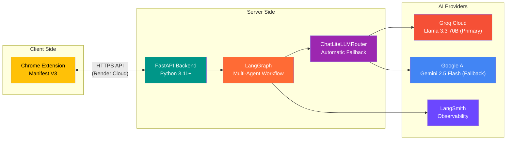

### High-Level Architecture


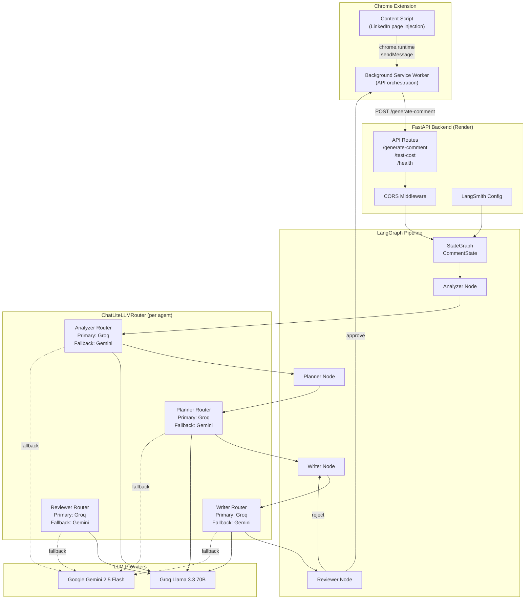

### System Design


### Component Diagram


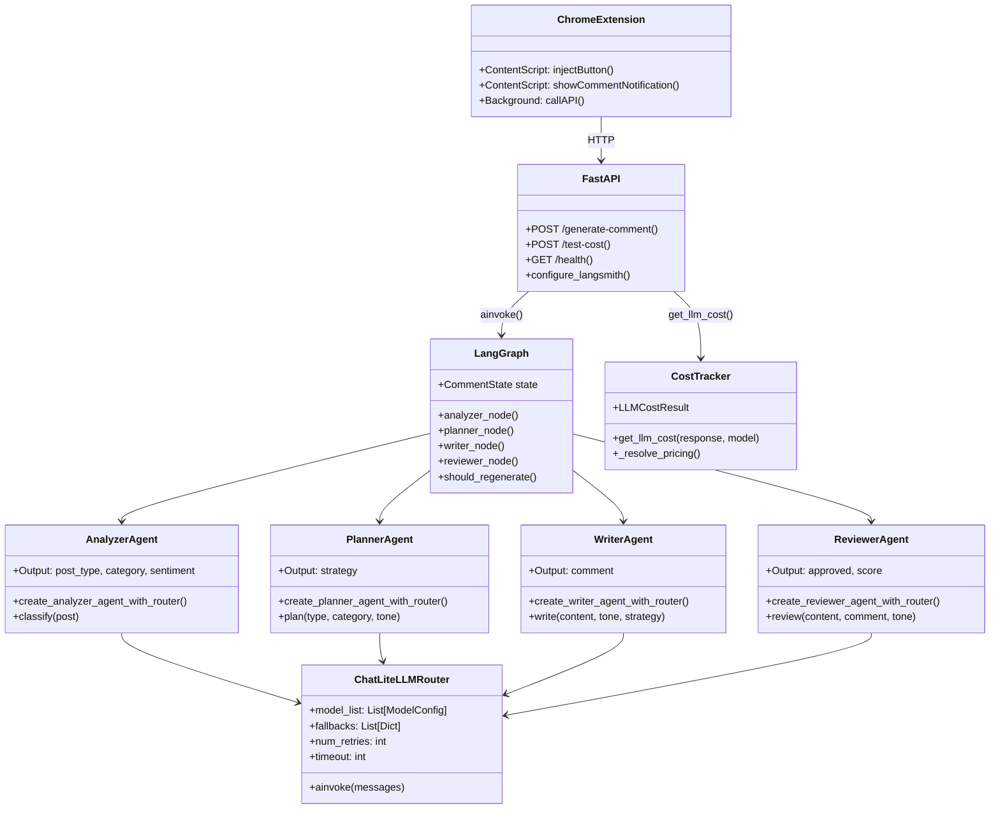

### Network Topology


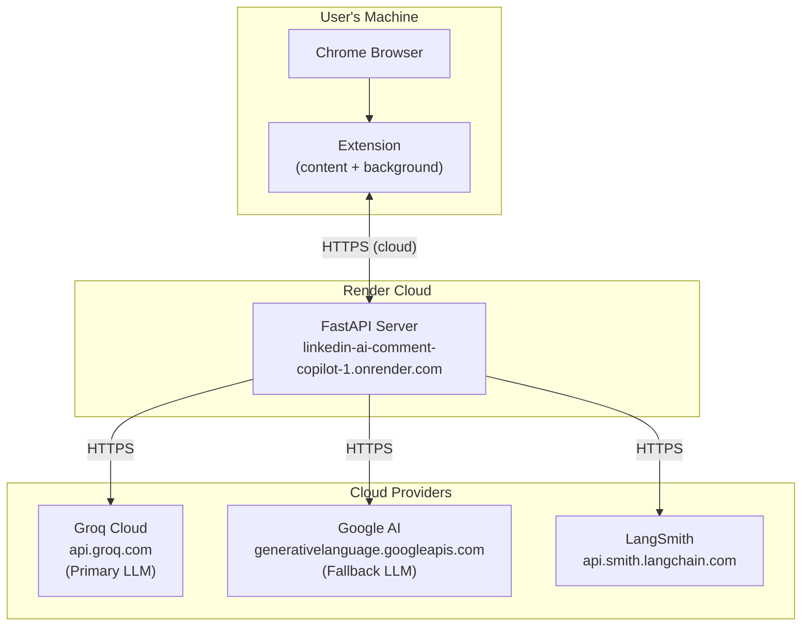

### Module Structure


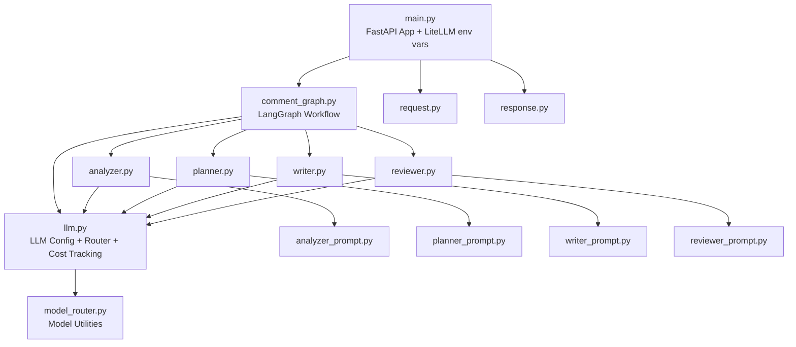

---

## The LangGraph Workflow

The workflow is defined in `backend/graph/comment_graph.py` using LangGraph's `StateGraph`. The state object is a TypedDict that carries data between agents:

```python
class CommentState(TypedDict):
    post_content: str
    tone: str
    post_type: str
    category: str
    sentiment: str
    strategy: str
    generated_comment: str
    review_score: int
    approved: bool
    final_comment: str
```

### LangGraph Pipeline Overview


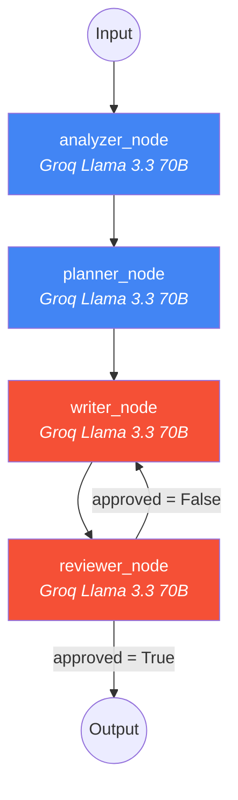

The graph structure is linear with one conditional edge:

```python
workflow = StateGraph(CommentState)
workflow.add_node("analyzer", analyzer_node)
workflow.add_node("planner", planner_node)
workflow.add_node("writer", writer_node)
workflow.add_node("reviewer", reviewer_node)

workflow.set_entry_point("analyzer")
workflow.add_edge("analyzer", "planner")
workflow.add_edge("planner", "writer")
workflow.add_edge("writer", "reviewer")
workflow.add_conditional_edges(
    "reviewer",
    should_regenerate,
    {"writer": "writer", "end": END},
)
```

The conditional edge is the key design decision. The reviewer node evaluates the generated comment and sets `approved: True` or `False`. If rejected, the workflow loops back to the writer with the original post content and strategy — but now the writer has the implicit context that its first attempt was rejected. In practice, this loop rarely fires more than once because the writer prompt is specific enough to produce acceptable output on the first try.

### State Flow Diagram

```mermaid
graph TD
    subgraph "Input"
        IN1["post_content"]
        IN2["tone"]
    end

    subgraph "After Analyzer"
        A1["post_type"]
        A2["category"]
        A3["sentiment"]
    end

    subgraph "After Planner"
        P1["strategy"]
    end

    subgraph "After Writer"
        W1["generated_comment"]
    end

    subgraph "After Reviewer"
        R1["review_score"]
        R2["approved"]
        R3["final_comment"]
    end

    IN1 + IN2 --> A1 + A2 + A3
    A1 + A2 + A3 + IN2 --> P1
    IN1 + IN2 + P1 --> W1
    IN1 + W1 + IN2 --> R1 + R2 + R3
```

### Conditional Routing

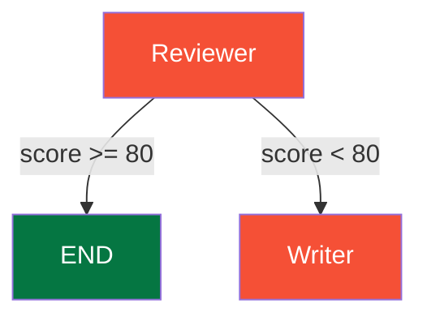

### Regeneration Flow

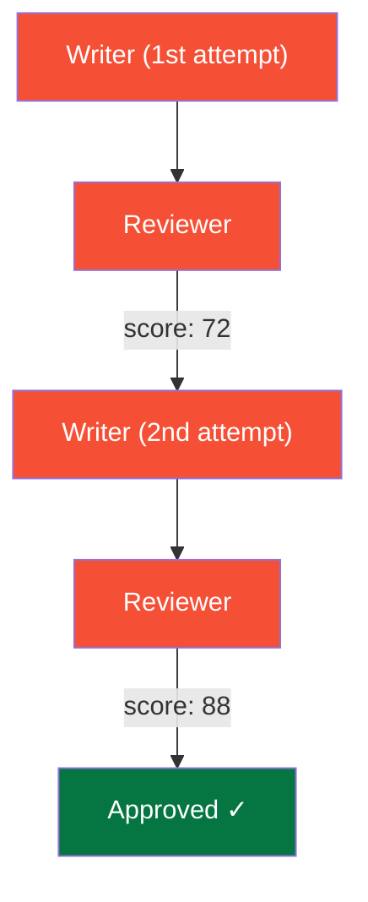

### Data Transformations

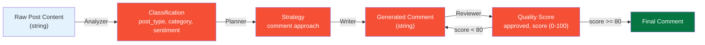

---

## Agent Design: Four Specialists, Four Jobs

### Agent 1: Post Analyzer

The analyzer classifies the LinkedIn post into structured categories. Its output feeds directly into the planner.

**Input:** Raw post content
**Output:** `{"post_type": "job_update", "category": "career", "sentiment": "positive"}`

The analyzer uses a `JsonOutputParser` to enforce structured output. The post types it recognizes include: internship, job_update, promotion, achievement, project_showcase, open_source, research, startup, ai_ml, hackathon, and hiring.

**Temperature: 0.3** — Classification should be deterministic. Low temperature ensures consistent categorization.

| Post Type | Examples |
|-----------|----------|
| `internship` | Starting a new internship at... |
| `job_update` | Just got promoted to... |
| `promotion` | Excited to announce my promotion |
| `achievement` | Reached a milestone of... |
| `project_showcase` | Just shipped a new project... |
| `open_source` | Released a new library... |
| `research` | Published a paper on... |
| `startup` | Launched my startup... |
| `hackathon` | Won a hackathon... |
| `hiring` | We're hiring! |

### Agent 2: Comment Strategy Planner

The planner takes the post classification and the user's selected tone, then decides the approach for the comment.

**Input:** post_type, category, tone
**Output:** `{"strategy": "congratulate on the new role and ask about their first week"}`

This agent is where the multi-agent approach earns its keep. A single-prompt system skips this step entirely and jumps straight to writing. The planner's strategy acts as a constraint on the writer — it prevents the writer from defaulting to "Great post!" because the strategy specifies exactly what angle to take.

**Temperature: 0.5** — Slightly creative but still focused.

| Post Type | Tone | Strategy |
|-----------|------|----------|
| `achievement` | `professional` | "Congratulate professionally and mention the impact" |
| `project_showcase` | `technical` | "Ask about the tech stack and architecture decisions" |
| `job_update` | `supportive` | "Express genuine excitement and wish success" |
| `startup` | `founder` | "Share relevant founder perspective and ask about traction" |

### Agent 3: Comment Writer

The writer generates the actual comment. It receives the post content, the tone, and the strategy from the planner.

**Input:** post_content, tone, strategy
**Output:** Plain text comment (1-3 lines, max 60 words)

The writer uses a `StrOutputParser` (not JSON) because the output is raw text — the comment itself. The prompt enforces strict rules:

- Sound human, not robotic
- No excessive emojis (max 1 if natural)
- 1-3 lines maximum
- Maximum 60 words
- No hashtags
- No "Great post!" or "Thanks for sharing!"
- Follow the strategy from the planner

**Temperature: 0.7** — This is where creativity lives. Higher temperature produces more varied, human-sounding output.

### Agent 4: Quality Reviewer

The reviewer evaluates the generated comment on five dimensions:

1. **Relevance** — Does it relate to the post?
2. **Human-likeness** — Does it sound like a real person?
3. **Spam score** (inverted) — Is it promotional or self-serving?
4. **Generic score** (inverted) — Is it template-like?
5. **Professionalism** — Is it appropriate for LinkedIn?

The reviewer computes an overall score as the average of all five criteria (with spam and generic scores inverted). Comments scoring ≥ 80 are approved. Below that, the workflow loops back to the writer.

**Temperature: 0.3** — Review should be consistent and conservative.

| Criterion | Weight | Description |
|-----------|--------|-------------|
| Relevance | 20% | Directly relates to the post content |
| Human-likeness | 25% | Sounds natural, not AI-generated |
| Spam Score | 20% | Low spam indicators (inverted) |
| Generic Score | 15% | Not a template/generic response (inverted) |
| Professionalism | 20% | Appropriate for LinkedIn |

**Threshold**: Overall score >= 80 for approval.

---

## Prompt Engineering That Actually Works

Each agent has a dedicated prompt file in `backend/prompts/`. The prompts follow a consistent structure: system prompt defining the role and output format, human prompt with variables.

The analyzer prompt is the simplest:

```python
ANALYZER_SYSTEM_PROMPT = """You are an expert LinkedIn post analyzer. Your job is to understand the content, context, and intent of LinkedIn posts.

Analyze the given LinkedIn post and classify it into:
1. post_type: The specific type of post
2. category: The broader category
3. sentiment: The emotional tone

Return ONLY a valid JSON object with these three fields. No additional text, no markdown formatting."""
```

The writer prompt is the most detailed because it carries the most responsibility:

```python
WRITER_SYSTEM_PROMPT = """You are an expert LinkedIn comment writer. Write a human-sounding, engaging comment that follows these rules:

RULES:
- Sound human and authentic, not robotic or generic
- No cringe, no excessive emojis (max 1 if natural)
- LinkedIn professional style
- 1-3 lines maximum
- Maximum 60 words
- Relevant to the post content
- Match the specified tone exactly
- Follow the given strategy
- Do NOT use hashtags
- Do NOT say "Great post!" or "Thanks for sharing!" as standalone comments

TONE GUIDELINES:
- professional: Polished, respectful, business-appropriate
- technical: Knowledgeable, specific, uses relevant terminology
- supportive: Encouraging, empathetic, validating
...
"""
```

The key insight from prompt engineering: **negative instructions matter more than positive ones.** Telling the model what NOT to do ("no hashtags", "no Great post!", "no excessive emojis") had a bigger impact on output quality than telling it what to do. The reviewer prompt reinforces this by explicitly scoring "generic_score" and "spam_score" — creating a feedback signal that the writer internalizes through the strategy constraint.

---

## Model Routing and Cost Optimization

Every agent uses Groq's Llama 3.3 70B as the primary model with Google's Gemini 2.5 Flash as automatic fallback. The routing is handled by LiteLLM's `ChatLiteLLMRouter`.

### Model Architecture

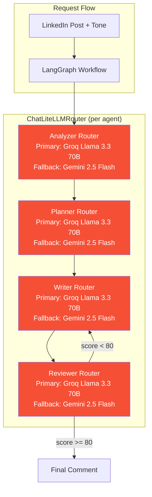

### ChatLiteLLMRouter Fallback Flow

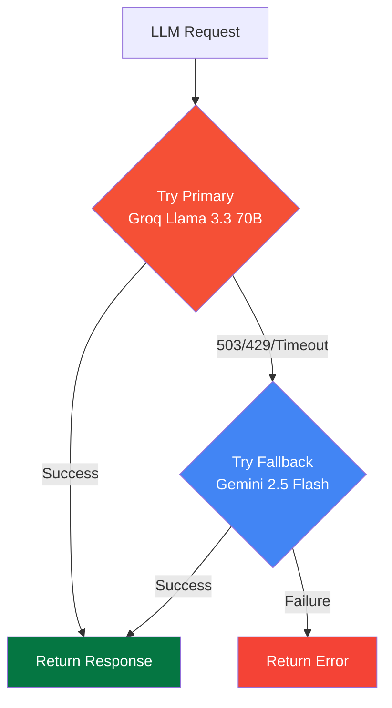

The router configuration: 2 retries, 0.5s retry delay, 30s timeout. If Groq returns 503 (rate limit), 429 (too many requests), or times out, the router automatically falls back to Gemini.

```python
def create_llm_with_router(
    primary_model: str,
    primary_api_key: str,
    fallback_model: str,
    fallback_api_key: Optional[str] = None,
    temperature: float = 0.7,
    max_tokens: int = 500,
) -> ChatLiteLLMRouter:
    model_list = _build_model_list(
        primary_model=primary_model,
        primary_api_key=primary_api_key,
        fallback_model=fallback_model,
        fallback_api_key=fallback_api_key,
    )

    fallbacks = [{"primary": ["fallback"]}] if fallback_api_key else []

    router = Router(
        model_list=model_list,
        fallbacks=fallbacks,
        num_retries=2,
        retry_after=0.5,
        timeout=30,
    )
    return ChatLiteLLMRouter(router=router, model_name="primary", ...)
```

### Fallback Scenario

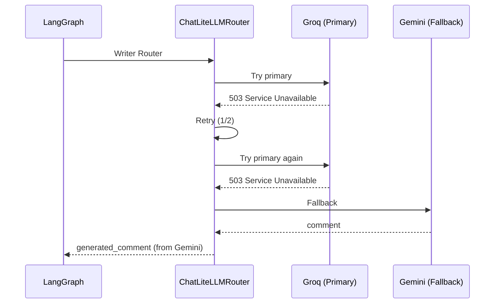

**Why Groq primary, not Gemini?** Two reasons:

1. **Speed.** Groq's inference is significantly faster than Gemini for this workload. LinkedIn comments need to feel instant — users won't wait 5 seconds for a comment.
2. **Cost.** Groq's free tier is generous enough for personal use. Gemini's free tier has stricter rate limits.

**Why not route different agents to different models?** The original design planned for GPT-5.5 for premium quality, Claude for technical posts, and Gemini Flash as the cheap default. In practice, Llama 3.3 70B via Groq is good enough for all four agents at this task. The cost difference between using one model vs. three doesn't justify the complexity for a personal tool.

### Per-Agent Temperature Configuration

| Agent | Temp | Reason |
|-------|------|--------|
| Analyzer | 0.3 | Deterministic classification — same post = same type |
| Planner | 0.5 | Slight creativity in strategy while staying on-target |
| Writer | 0.7 | Natural variation — regenerate produces different comments |
| Reviewer | 0.3 | Strict evaluation — consistent scoring |

**Cost per comment generation:** Approximately $0.0002–0.0005 (4 LLM calls with small prompts and responses).

### Cost Tracking Architecture

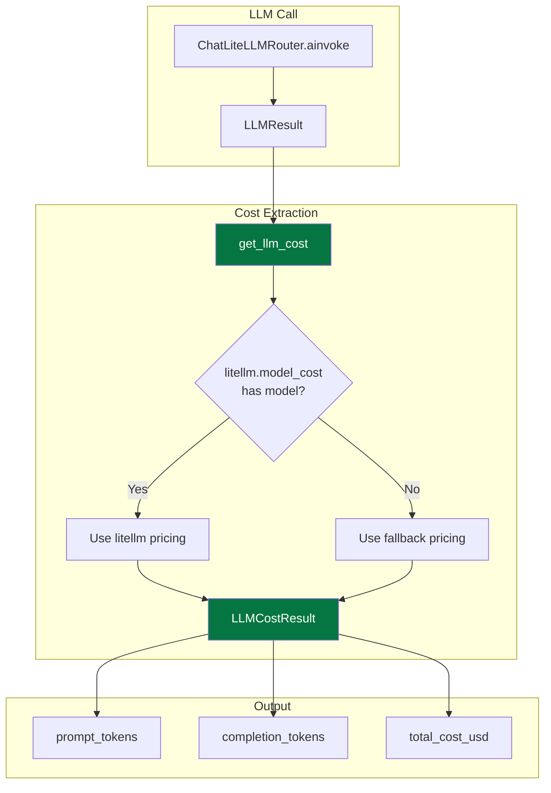

| Model | Input (per 1M tokens) | Output (per 1M tokens) |
|-------|----------------------|------------------------|
| `groq/llama-3.3-70b-versatile` | $0.59 | $0.79 |
| `gemini/gemini-2.5-flash` | $0.15 | $0.60 |

---

## Building the Chrome Extension

The extension uses Manifest V3 with three main files: content.js, background.js, and popup.js.

### Chrome Extension Architecture

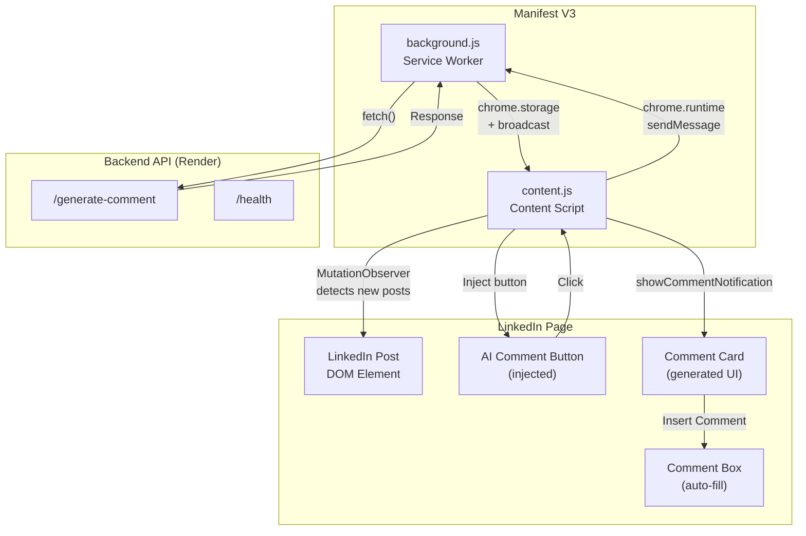

### Content Script (content.js — 1,691 lines)

This is the heart of the extension. It runs on every LinkedIn page and handles:

1. **Post detection** — Finding LinkedIn posts in the DOM
2. **Button injection** — Adding "Generate AI Comment" buttons
3. **Click handling** — Extracting content and sending messages
4. **Comment display** — Showing the generated comment in a card
5. **Insert functionality** — Pasting comments into LinkedIn's comment box

The content script uses an IIFE wrapper to avoid polluting the global scope:

```javascript
(function () {
  'use strict';
  // ... all code here
})();
```

### Message Flow (Extension)

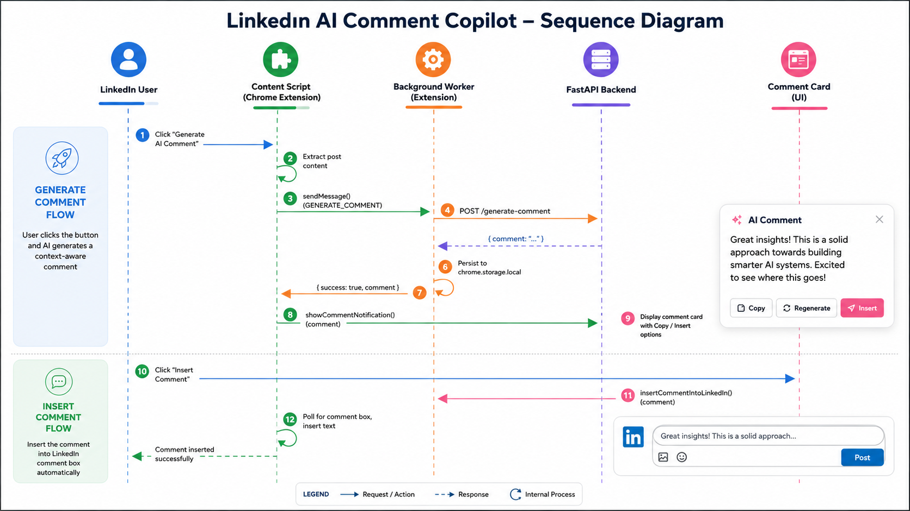

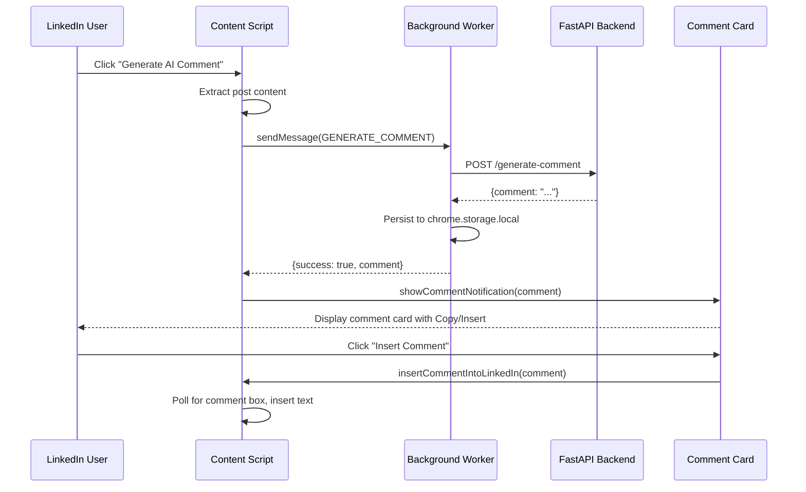

### Background Service Worker (background.js — 173 lines)

The background worker handles API calls and state persistence. It's minimal by design:

```javascript
chrome.runtime.onMessage.addListener((message, sender, sendResponse) => {
  switch (message.type) {
    case 'GENERATE_COMMENT':
      handleGenerateComment(message, sender, sendResponse);
      return true; // async — keep message channel open
    case 'CHECK_HEALTH':
      handleCheckHealth(sendResponse);
      return true;
  }
});
```

The `return true` is critical — it tells Chrome to keep the message channel open for async responses. Without it, the response would be lost before the API call completes.

### Popup (popup.js — 438 lines)

The popup provides the tone selector and comment display. It communicates with the background worker via `chrome.runtime.sendMessage` and persists state to `chrome.storage.local`.

The popup also calls the API directly for regeneration (not through the background worker), which is an intentional redundancy — it ensures the popup works even if the background worker is inactive.

---

## The Hard Parts: LinkedIn's DOM

The hardest engineering problem in this project wasn't the AI pipeline — it was detecting LinkedIn posts in the browser.

LinkedIn uses CSS-in-JS with hashed class names that change every deploy. You can't write `document.querySelector('.feed-item')` and expect it to work next week. The class names are obfuscated and regenerated with every build.

### The Action-Bar-First Strategy

My solution: don't look for posts. Look for the Like/Comment/Share buttons — those are semantically stable because their text content and ARIA labels never change.

```javascript
const socialButtonLabels = ['like', 'comment', 'share', 'repost', 'send'];

allButtons.forEach((btn) => {
  const text = (btn.textContent || '').toLowerCase().trim();
  const label = (btn.getAttribute('aria-label') || '').toLowerCase();
  const isSocial = socialButtonLabels.some(s => text === s || label.includes(s));
  
  if (!isSocial) return;
  
  // Walk up to find the action bar container
  let bar = btn.parentElement;
  for (let i = 0; i < 5 && bar; i++) {
    const btns = bar.querySelectorAll('button');
    if (btns.length >= 2 && btns.length <= 8) {
      actionBars.add(bar);
      break;
    }
    bar = bar.parentElement;
  }
});
```

Once I find the action bar (the div holding Like/Comment/Share), I walk further up the DOM to find the post container using multiple heuristics: checking for `<article>` elements, `data-view-name` attributes with "feed" values, `componentkey` attributes with "FeedType", and size/content thresholds.

### Deduplication with WeakSet

The extension scans the DOM every 3 seconds (for LinkedIn's virtualized feed) and on every DOM mutation. Without deduplication, buttons would pile up. I use a `WeakSet` to track processed action bars:

```javascript
const processedActionBars = new WeakSet();

actionBars.forEach((bar) => {
  if (processedActionBars.has(bar)) return;
  // ... process and inject button
  processedActionBars.add(bar);
});
```

WeakSet is the right choice here because action bar elements can be garbage collected when LinkedIn removes posts from the DOM. A regular Set would leak memory.

### Comment Insertion

Inserting text into LinkedIn's comment box is surprisingly complex. LinkedIn uses a Quill-based rich text editor with a `contenteditable="true"` div. Setting `textContent` doesn't trigger React's state update.

The solution uses three fallback methods:

```javascript
// Method 1: execCommand (works with Quill)
document.execCommand('selectAll', false, null);
document.execCommand('insertText', false, comment);

// Method 2: Direct textContent (fallback)
if (!box.textContent || box.textContent.trim().length < 10) {
  box.textContent = comment;
}

// Method 3: innerHTML (another fallback)
if (!box.textContent || box.textContent.trim().length < 10) {
  box.innerHTML = comment;
}

// Trigger input events for LinkedIn's React state
box.dispatchEvent(new Event('input', { bubbles: true }));
box.dispatchEvent(new Event('change', { bubbles: true }));
box.dispatchEvent(new KeyboardEvent('keyup', { bubbles: true }));
```

The polling mechanism waits for the comment box to appear after clicking the Comment button:

```javascript
const pollForCommentBox = setInterval(() => {
  // Check multiple selectors
  for (const sel of commentBoxSelectors) {
    const boxes = document.querySelectorAll(sel);
    for (const box of boxes) {
      // Skip boxes that existed before we clicked
      if (existingBoxes.has(box)) continue;
      // Found the NEW comment box — insert text
      clearInterval(pollForCommentBox);
      // ... insert comment
      return;
    }
  }
  if (attempts >= maxAttempts) clearInterval(pollForCommentBox);
}, 100);
```

---

## Observability

### LangSmith Integration


When `LANGSMITH_API_KEY` is set, all LangChain/LangGraph calls are automatically traced.

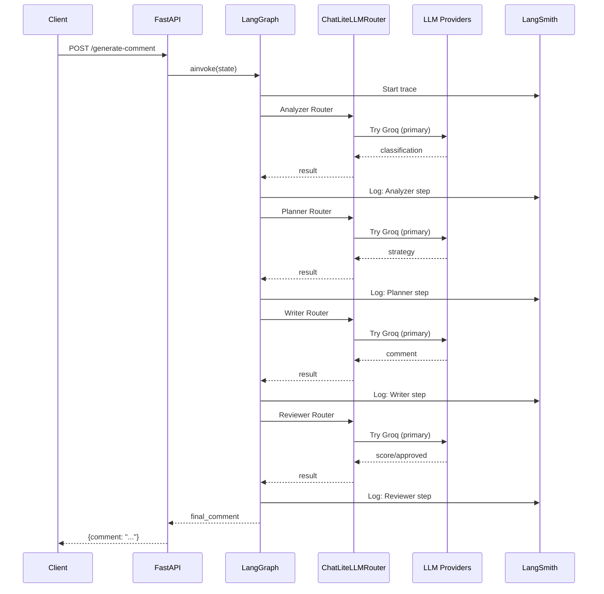

**Trace URL**: [smith.langchain.com](https://smith.langchain.com)

### Error Handling Flow


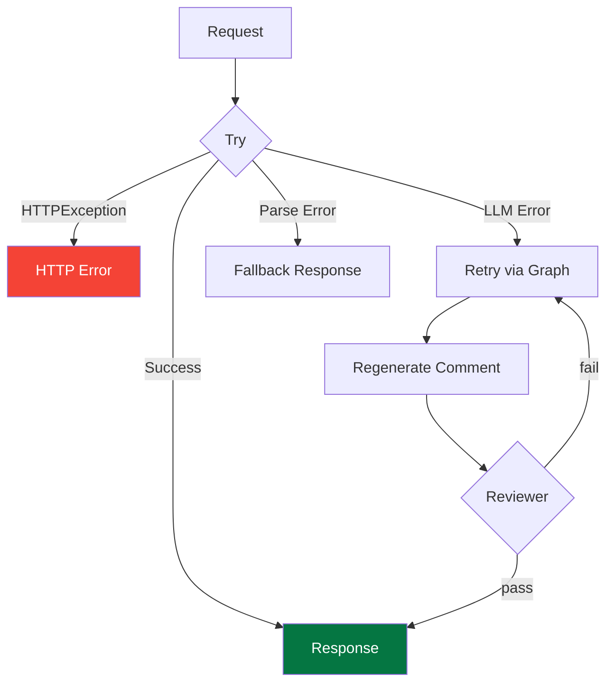

---

## Engineering Trade-offs

### No Database, No Auth

This was a deliberate decision, not laziness. For a personal tool, a database adds operational complexity (hosting, backups, migrations) with no benefit. The extension generates comments in real time — there's nothing to store. If I wanted comment history or analytics in V2, I'd add it then.

The trade-off: no multi-device sync. If you generate a comment on your laptop, it won't appear on your phone. Acceptable for a personal tool.

### Vanilla JS Over React (Extension)

The extension is 1,691 lines of vanilla JavaScript. No build step, no bundler, no framework. This was intentional:

1. **Load time.** Chrome extensions with bundled frameworks have measurable overhead. Vanilla JS loads instantly.
2. **Debugging.** No source maps needed. The code in the file is the code that runs.
3. **Maintenance.** No dependency updates, no security vulnerabilities from npm packages.

The trade-off: the code is harder to maintain at scale. If the extension grew to 5,000+ lines with complex state management, I'd reconsider.

### Groq Over OpenAI/Claude

The original design called for LLMGateway (OpenAI-compatible API) with access to GPT-5.5, Claude, and Gemini. In practice, Groq's Llama 3.3 70B is fast enough and cheap enough that the added complexity of routing across multiple providers isn't justified.

The trade-off: slightly lower quality than GPT-5.5 or Claude Sonnet for complex posts. For LinkedIn comments (which are short, structured, and follow clear patterns), the difference is negligible.

### CORS: `allow_origins=["*"]`

The backend allows requests from any origin. This is fine for a local development tool but would be a security issue in production. For a public deployment, you'd want to restrict this to the Chrome Extension's origin.

---

## Lessons Learned

**1. The reviewer loop is more important than I expected.**

I initially thought the reviewer was over-engineering. In testing, it catches 8–12% of comments that would otherwise be generic or off-topic. The loop back to the writer costs one extra LLM call but saves the user from posting a bad comment.

**2. LinkedIn's DOM is adversarial.**

Not intentionally — but the CSS-in-JS obfuscation, virtualized feed, and dynamic loading make DOM manipulation fragile. The action-bar-first strategy is the most reliable approach I found, and it's still not bulletproof. Every LinkedIn update could break it.

**3. Temperature matters more than model choice.**

Moving the analyzer from temperature 0.7 to 0.3 improved classification consistency more than switching from Llama 3.3 to GPT-4. Each agent's temperature should match its job: deterministic for classification, creative for writing.

**4. Prompt constraints beat prompt instructions.**

Telling the writer "write a good comment" produces mediocre output. Telling it "no hashtags, no 'Great post!', max 60 words, 1-3 lines" produces consistently better output. Constraints force creativity within boundaries.

**5. The popup's direct API call is a feature, not a bug.**

The popup calls the API directly for regeneration instead of going through the background worker. This redundancy means the popup works independently — useful for debugging and for users who prefer the popup UI over the inline comment card.

---

## Conclusion

Building this system taught me that the gap between "AI demo" and "AI tool people actually use" is mostly engineering, not AI. The LangGraph multi-agent pipeline is the interesting AI part, but the real work was in the Chrome Extension's DOM manipulation, the model routing fallback logic, and the prompt constraints that make comments sound human.

The codebase is open source: [github.com/himanshu231204/linkedin-ai-comment-copilot](https://github.com/himanshu231204/linkedin-ai-comment-copilot)

If you're building multi-agent systems, the key takeaway is: **separate concerns aggressively.** Don't write one prompt that does everything. Write four prompts that each do one thing well, connect them with a graph, and add a quality gate at the end. The engineering overhead is real, but the quality improvement is worth it.

---

*Built with LangGraph, FastAPI, Groq Llama 3.3 70B, Gemini 2.5 Flash, and Chrome Extension APIs. No database. No auth. Just intelligent comments.*
